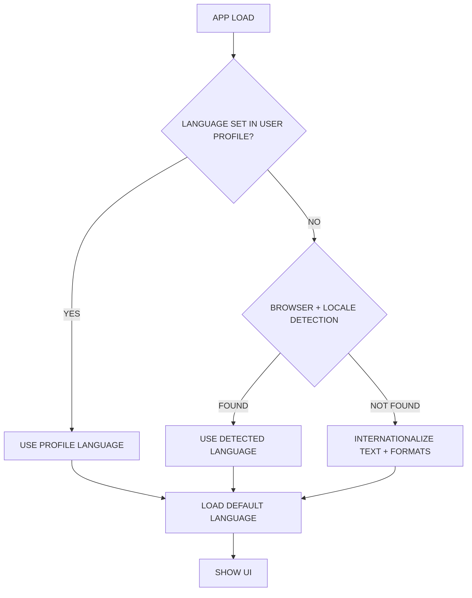

# Internationalization (i18n) and Localization (l10n) User Guide

This comprehensive guide covers multi-language support in the Digame application, including setup, maintenance, and future enhancements for both the FastAPI backend and Next.js/React frontend.

## 🌍 Current Language Support

**Active Languages:**
- 🇺🇸 **English (en)** - Default language
- 🇪🇸 **Spanish (es)** - Full support

**Recently Removed:**
- ~~Arabic (ar)~~ - Removed to optimize build performance (can be re-added if needed)

**Ready to Add:**
- 🇵🇹 **Portuguese (pt)** - Infrastructure ready, translations needed

## Backend (FastAPI)

The backend uses `Babel` and `python-gettext` for internationalization.

### 1. Marking Strings for Translation

In Python code, use the `_()` function (imported from `digame.app.i18n`) for strings that need translation. Due to current limitations with Babel's ability to extract strings from functions with complex signatures like our `_(request, text)`, we use a two-step process for marking and translating:

```python
from digame.app.i18n import _, _extract # _extract is for marking, _ is for runtime

# Example in an endpoint
async def some_endpoint(request: Request):
    message_id = _extract("This is a translatable string.") # Mark for extraction
    translated_message = _(request, message_id) # Translate at runtime
    return {"detail": translated_message}
```

Ensure `_extract` (or any other marker function you choose) is added to the `keywords` list in `digame/babel.cfg`.

### 2. Extracting Translatable Strings

After adding or changing translatable strings:

1.  **Navigate to the `digame` directory**:
    ```bash
    cd path/to/your/project/digame
    ```
2.  **Run `pybabel extract`**:
    This command scans the specified source files (configured in `babel.cfg`) and creates/updates the `app/locales/messages.pot` template file.
    ```bash
    pybabel extract -F babel.cfg \
      --output-file=app/locales/messages.pot \
      --project="Digame" \
      --version="1.0" \
      --copyright-holder="Digame Team" \
      --msgid-bugs-address="support@example.com" \
      .
    ```
    *Note: `babel.cfg` has been configured to exclude certain directories like `app/routers/`, `app/services/`, etc., due to pre-existing syntax issues. If you make translatable changes in those areas, the syntax issues must be fixed first, or the `babel.cfg` updated to include them.*

### 3. Adding a New Language

Let's say you want to add French (`fr`):

1.  **Initialize the language catalog** (run from the `digame` directory):
    ```bash
    pybabel init -i app/locales/messages.pot -d app/locales -l fr
    ```
    This creates `app/locales/fr/LC_MESSAGES/messages.po`.

2.  **Translate the strings**: Edit the newly created `messages.po` file. For each `msgid`, provide the translation in `msgstr`.
    Example for French:
    ```po
    #: app/main.py:268
    msgid "Welcome to the Digame API"
    msgstr "Bienvenue à l'API Digame"
    ```

3.  **Update `SUPPORTED_LANGUAGES`**: Add the new language code to the `SUPPORTED_LANGUAGES` list in `digame/app/i18n.py`.

### 4. Updating Existing Translations

After extracting new strings (step 2):

1.  **Update existing `.po` files** (run from the `digame` directory):
    ```bash
    pybabel update -i app/locales/messages.pot -d app/locales --previous --no-fuzzy-matching
    ```
    This merges new strings into each language's `.po` file and marks changed strings as fuzzy if needed (though `--no-fuzzy-matching` disables this for exact matches). Review and update translations in each `.po` file.

### 5. Compiling Translations

After adding or updating translations in `.po` files:

1.  **Compile all catalogs** (run from the `digame` directory):
    ```bash
    pybabel compile -d app/locales --statistics
    ```
    This generates/updates the binary `.mo` files that are used by the application at runtime.

## 🚀 Quick Start: Adding Portuguese Support

**Time Required:** 15 minutes | **Difficulty:** Easy

### Step 1: Update Configuration Files (2 minutes)

**File 1:** `frontend/next.config.js`
```javascript
i18n: {
  locales: ['en', 'es', 'pt'], // Add 'pt' here
  defaultLocale: 'en',
},
```

**File 2:** `frontend/next-i18next.config.js`
```javascript
i18n: {
  defaultLocale: 'en',
  locales: ['en', 'es', 'pt'], // Add 'pt' here
},
```

### Step 2: Create Portuguese Translation File (10 minutes)

Create: `frontend/public/locales/pt/common.json`
```json
{
  "getStarted": "Começar",
  "heroTitlePart1": "Seu Gêmeo Digital",
  "heroTitlePart2": "Profissional",
  "heroSubtitle": "Desbloqueie seu potencial profissional com análise comportamental alimentada por IA, insights preditivos e recomendações personalizadas de desenvolvimento de carreira.",
  "featureBehavioralAnalysisTitle": "Análise Comportamental",
  "featureBehavioralAnalysisText": "Algoritmos avançados de ML analisam seus padrões de trabalho e identificam oportunidades de otimização",
  "featurePredictiveInsightsTitle": "Insights Preditivos",
  "featurePredictiveInsightsText": "Obtenha previsões personalizadas sobre sua trajetória profissional e desenvolvimento de habilidades",
  "featureGoalAchievementTitle": "Conquista de Objetivos",
  "featureGoalAchievementText": "Defina e acompanhe objetivos profissionais com recomendações alimentadas por IA e monitoramento de progresso",
  "footerCopyright": "© 2025 Digame. Sua Plataforma de Gêmeo Digital Profissional."
}
```

### Step 3: Update Language Switcher (1 minute)

**File:** `frontend/src/components/layout/LanguageSwitcher.jsx`
```javascript
const supportedLocales = ['en', 'es', 'pt']; // Add 'pt' here
```

### Step 4: Test & Deploy (2 minutes)
```bash
cd frontend
npm run build  # Should generate ~650 pages (up from 433)
```

**Result:** Portuguese language support fully functional! 🎉

---

## Frontend (Next.js / `next-i18next`)

The frontend uses `next-i18next` (which uses `i18next` and `react-i18next`) with a fully configured infrastructure.

### 1. Current Configuration

**✅ Properly Configured Files:**
*   `frontend/next-i18next.config.js`: Main configuration for supported locales, default locale, etc.
*   `frontend/next.config.js`: Includes the `i18n` config from `next-i18next.config.js`.
*   `frontend/src/pages/_app.js`: **Fixed** - Now properly wrapped with `appWithTranslation`.
*   `frontend/src/pages/_document.jsx`: Sets `lang` and `dir` attributes on the `<html>` tag.

**Recent Fixes Applied:**
- ✅ Added missing `appWithTranslation` HOC wrapper
- ✅ Removed Arabic language support to optimize build performance
- ✅ All i18n warnings resolved
- ✅ Build process optimized for current language set

### 2. Translation Files

Translations are stored in JSON files located at `digame/frontend/public/locales/{locale}/{namespace}.json`.
*   `{locale}`: Language code (e.g., `en`, `es`, `ar`).
*   `{namespace}`: Namespace for organizing translations (default is `common`). Example: `common.json`.

Example for `en/common.json`:
```json
{
  "myKey": "My translated text in English",
  "anotherKey": "Another piece of text"
}
```

### 3. Marking Strings for Translation (in Components)

Use the `useTranslation` hook from `next-i18next`:

```jsx
import { useTranslation } from 'next-i18next';

function MyComponent() {
  const { t, i18n } = useTranslation('common'); // Specify namespace if not 'common'

  return (
    <div>
      <h1>{t('myKey', 'Default text if key not found')}</h1>
      <p>{t('anotherKey')}</p>
    </div>
  );
}
```

For components that need to be compatible with SSR and static generation, you might need to use `serverSideTranslations` in `getStaticProps` or `getServerSideProps` in your page components.

### 4. Adding/Updating Translations

1.  Identify the string you want to translate.
2.  Choose an appropriate key (e.g., `welcomeMessageHomepage`).
3.  Add this key and its translation to each language's JSON file(s) (e.g., `public/locales/en/common.json`, `public/locales/es/common.json`, etc.).

Example - adding `myNewFeatureTitle`:
In `public/locales/en/common.json`:
```json
{
  // ... existing keys ...
  "myNewFeatureTitle": "My New Awesome Feature"
}
```
In `public/locales/es/common.json`:
```json
{
  // ... existing keys ...
  "myNewFeatureTitle": "Mi Nueva Característica Impresionante"
}
```

### 5. Adding a New Language

1.  **Update `next-i18next.config.js`**: Add the new language code to the `locales` array.
    ```javascript
    // digame/frontend/next-i18next.config.js
    module.exports = {
      i18n: {
        defaultLocale: 'en',
        locales: ['en', 'es', 'ar', 'fr'], // Added 'fr'
      },
      // ... other settings
    };
    ```
2.  **Create new locale directory**: Create a new directory under `digame/frontend/public/locales/` for the new language (e.g., `fr`).
3.  **Add translation files**: Copy an existing namespace file (e.g., `common.json`) into the new language directory and translate its content.
    Example: `digame/frontend/public/locales/fr/common.json`.

## RTL (Right-To-Left) Support

RTL support is primarily a frontend concern.

### 1. HTML `dir` Attribute

The `digame/frontend/src/pages/_document.jsx` file dynamically sets `dir="rtl"` or `dir="ltr"` on the `<html>` tag based on the currently detected language (e.g., 'ar' is RTL).

### 2. CSS Styling for RTL

*   **Logical Properties**: Prefer CSS logical properties over directional ones:
    *   `margin-inline-start` instead of `margin-left`
    *   `padding-inline-end` instead of `padding-right`
    *   `border-start-start-radius` instead of `border-top-left-radius`
    *   `text-align: start` instead of `text-align: left`
*   **Flexbox/Grid**: These layout systems are generally good with RTL if you avoid hardcoding directions. The browser often handles flipping automatically when `dir="rtl"` is set.
*   **MUI**: Material-UI (MUI) v5+ (which uses Emotion) has good built-in RTL support. It typically adapts components automatically when `dir="rtl"` is on a parent element. Ensure your theme is correctly configured if you have a custom theme. For older MUI versions or specific needs, JSS users might need `jss-rtl`.
*   **Directional Icons/Images**: Icons or images that imply directionality (e.g., arrows) may need to be flipped in RTL languages. This can be done with CSS:
    ```css
    [dir="rtl"] .my-directional-icon {
      transform: scaleX(-1);
    }
    ```
*   **Testing**: Thoroughly test the UI in an RTL language (e.g., Arabic) to catch layout issues.

## 🔮 Future Enhancements: Intelligent Language Selection

Based on the provided flowchart, here are planned enhancements to make language selection more intuitive and user-centric:

### 1. Smart Language Detection Flow



### 2. User Profile Language Preferences

**Implementation Plan:**

**Database Schema Addition:**
```sql
-- Add to user profile table
ALTER TABLE user_profiles ADD COLUMN preferred_language VARCHAR(5) DEFAULT 'en';
ALTER TABLE user_profiles ADD COLUMN auto_detect_language BOOLEAN DEFAULT true;
ALTER TABLE user_profiles ADD COLUMN language_set_manually BOOLEAN DEFAULT false;
```

**Frontend Implementation:**
```javascript
// User profile language preference
const useUserLanguage = () => {
  const { user } = useAuth();
  const { i18n } = useTranslation();
  
  useEffect(() => {
    if (user?.preferredLanguage && user.languageSetManually) {
      i18n.changeLanguage(user.preferredLanguage);
    } else if (user?.autoDetectLanguage) {
      // Use browser detection
      const detectedLang = detectBrowserLanguage();
      i18n.changeLanguage(detectedLang);
    }
  }, [user, i18n]);
};
```

### 3. Onboarding Language Selection

**New User Registration Flow:**
```jsx
// Language selection during onboarding
const LanguageSelectionStep = () => {
  const [selectedLanguage, setSelectedLanguage] = useState('');
  const [autoDetect, setAutoDetect] = useState(true);
  
  return (
    <div className="onboarding-language-step">
      <h2>Choose Your Language / Escolha seu idioma / Choisissez votre langue</h2>
      
      <div className="language-options">
        <LanguageCard
          code="en"
          name="English"
          flag="🇺🇸"
          selected={selectedLanguage === 'en'}
          onClick={() => setSelectedLanguage('en')}
        />
        <LanguageCard
          code="es"
          name="Español"
          flag="🇪🇸"
          selected={selectedLanguage === 'es'}
          onClick={() => setSelectedLanguage('es')}
        />
        <LanguageCard
          code="pt"
          name="Português"
          flag="🇵🇹"
          selected={selectedLanguage === 'pt'}
          onClick={() => setSelectedLanguage('pt')}
        />
      </div>
      
      <Checkbox
        checked={autoDetect}
        onChange={setAutoDetect}
        label="Auto-detect language from browser settings"
      />
    </div>
  );
};
```

### 4. Advanced Language Features

**Contextual Language Switching:**
- **Business Context**: Switch to local business language for region-specific features
- **Content Language**: Different language for UI vs. content consumption
- **Team Language**: Inherit team/organization language preferences

**Smart Fallbacks:**
```javascript
// Intelligent fallback system
const getTranslationWithFallback = (key, options = {}) => {
  const { t, i18n } = useTranslation();
  
  // Try current language
  let translation = t(key, { ...options, fallback: false });
  
  // Fallback to user's secondary language
  if (!translation && user.secondaryLanguage) {
    translation = t(key, { ...options, lng: user.secondaryLanguage, fallback: false });
  }
  
  // Fallback to English
  if (!translation) {
    translation = t(key, { ...options, lng: 'en' });
  }
  
  return translation;
};
```

### 5. Localization Beyond Translation

**Regional Customization:**
- **Date/Time Formats**: Automatic formatting based on locale
- **Number Formats**: Currency, decimals, thousands separators
- **Address Formats**: Country-specific address layouts
- **Cultural Adaptations**: Color schemes, imagery, content flow

**Implementation Example:**
```javascript
// Locale-aware formatting
const useLocaleFormatting = () => {
  const { i18n } = useTranslation();
  
  const formatDate = (date) => {
    return new Intl.DateTimeFormat(i18n.language, {
      year: 'numeric',
      month: 'long',
      day: 'numeric'
    }).format(date);
  };
  
  const formatCurrency = (amount, currency = 'USD') => {
    return new Intl.NumberFormat(i18n.language, {
      style: 'currency',
      currency: currency
    }).format(amount);
  };
  
  return { formatDate, formatCurrency };
};
```

### 6. Analytics and Optimization

**Language Usage Tracking:**
- Track which languages are most used
- Identify translation gaps and quality issues
- Monitor user language switching patterns
- A/B test language detection accuracy

**Performance Optimization:**
- Lazy load translation files
- Cache frequently used translations
- Optimize bundle sizes per language
- Progressive translation loading

---

## General Workflow

### For Developers

1.  **Develop**: Add new user-facing strings in the code, marking them for translation as described above.
2.  **Extract (Backend)**: Run `pybabel extract` to update the `.pot` template.
3.  **Update Translations**:
    *   Backend: Run `pybabel update` and then edit `.po` files.
    *   Frontend: Manually add/update keys in JSON files.
4.  **Compile (Backend)**: Run `pybabel compile`.
5.  **Test**: Verify translations appear correctly in all supported languages and check RTL layouts.

### For Content Managers

1.  **Identify Content**: Review new features for translatable content
2.  **Create Translation Keys**: Work with developers to create meaningful key names
3.  **Coordinate Translation**: Manage professional translation services or internal translators
4.  **Quality Assurance**: Review translations in context within the application
5.  **Monitor Usage**: Track which languages need more attention or updates

### For Product Managers

1.  **Market Research**: Identify target markets and required languages
2.  **Prioritization**: Decide which languages to support based on user base and business goals
3.  **Resource Planning**: Allocate budget and time for translation and localization
4.  **User Experience**: Ensure language selection and switching is intuitive
5.  **Performance Monitoring**: Track impact of multi-language support on app performance

---

## 🛠️ Troubleshooting

### Common Issues and Solutions

**Build Warnings:**
- ✅ **Fixed**: `react-i18next:: You will need to pass in an i18next instance` - Resolved by adding `appWithTranslation` wrapper

**Missing Translations:**
- Check translation files exist in `frontend/public/locales/{language}/`
- Verify keys match exactly between languages
- Ensure `getStaticProps` includes `serverSideTranslations` for SSG pages

**Performance Issues:**
- Monitor build times with multiple languages
- Consider lazy loading for less common languages
- Use translation namespaces to split large translation files

**RTL Layout Issues:**
- Test thoroughly with Arabic or Hebrew
- Use CSS logical properties instead of directional ones
- Check icon and image orientations in RTL mode

---

## 📚 Additional Resources

### Translation Management Tools
- **Crowdin**: Professional translation management platform
- **Lokalise**: Translation management system with developer tools
- **Weblate**: Open-source web-based translation tool

### Testing Tools
- **Browser Language Testing**: Change browser language settings to test detection
- **RTL Testing**: Use browser extensions to simulate RTL layouts
- **Accessibility Testing**: Ensure screen readers work with multiple languages

### Performance Monitoring
- **Bundle Analysis**: Monitor JavaScript bundle sizes per language
- **Load Time Tracking**: Measure impact of translation loading on performance
- **User Analytics**: Track language usage patterns and switching behavior
