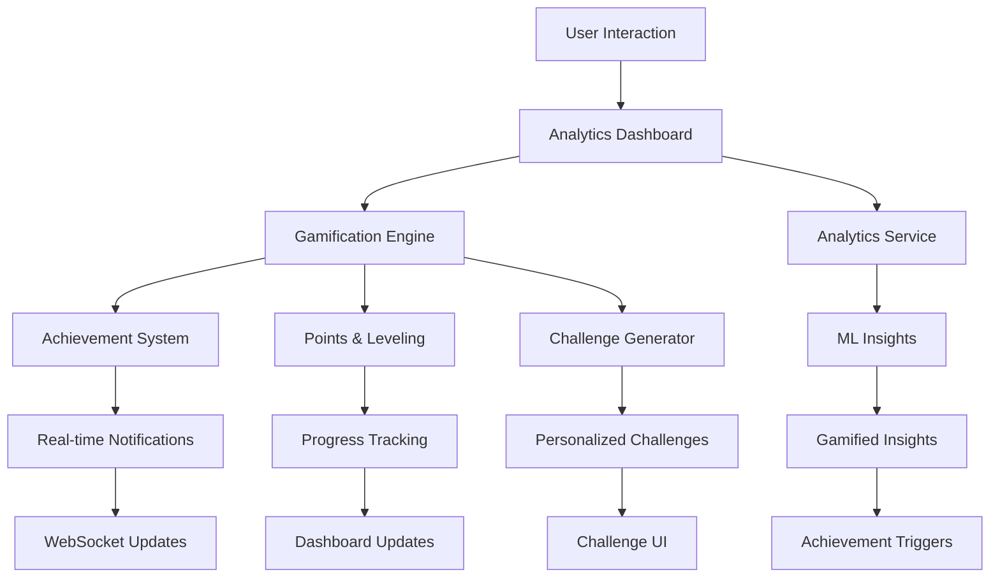

# Analytics Dashboard Gamification Enhancement Implementation Plan

## Executive Summary

This document provides a comprehensive implementation plan for enhancing the analytics dashboard with gamification insights, creating a unified experience that combines data-driven analytics with engaging gamification elements. This enhancement will transform the current analytics dashboard into an intelligent, motivational, and actionable insights platform.

## Current State Analysis

### Existing Analytics Infrastructure
- **Backend Services**: 15+ analytics services with ML capabilities
- **Dashboard Components**: Multiple dashboard types (Enterprise, Custom, Analytics)
- **Data Sources**: Performance metrics, user behavior, predictive models
- **Visualization**: Advanced charts, real-time data, export capabilities

### Current Gamification System
- **Achievement System**: 20+ achievement types with rarity levels
- **Points & Leveling**: Multi-category point system with experience tracking
- **Streaks**: Activity streaks with milestone tracking
- **Leaderboards**: Points and achievement-based rankings
- **Task Integration**: Automatic gamification for task completion

### Gap Analysis

#### Missing Integration Points (Current Gaps)
1. **Analytics-Gamification Bridge** (40%)
   - No connection between analytics insights and gamification rewards
   - Analytics achievements not tied to data discovery
   - Performance insights not gamified
   - No analytics-based challenges or goals

2. **Motivational Analytics** (35%)
   - Static analytics without engagement elements
   - No progress visualization for analytics usage
   - Missing achievement tracking for data exploration
   - No social elements in analytics sharing

3. **Intelligent Insights Gamification** (25%)
   - ML insights not connected to achievement system
   - No gamified anomaly detection
   - Predictive analytics not tied to user progression
   - Missing competitive analytics elements

## Implementation Plan

### Phase 1: Analytics-Gamification Integration (Weeks 1-2)

#### Objective
Create seamless integration between analytics dashboard and gamification system, enabling users to earn achievements and points through analytics engagement.

#### Week 1: Core Integration Infrastructure

**Backend Integration:**
1. **Enhanced Analytics Service** - [`app/services/analytics_service.py`](app/services/analytics_service.py)
   ```python
   class AnalyticsGamificationService:
       def __init__(self, analytics_service, gamification_service):
           self.analytics = analytics_service
           self.gamification = gamification_service
       
       async def track_analytics_engagement(self, user_id: int, action: str, context: Dict):
           """Track analytics actions for gamification"""
           # Award points for analytics usage
           # Check for analytics achievements
           # Update analytics streaks
           # Generate insights-based challenges
   ```

2. **Gamification Analytics Achievements** - New achievement categories
   ```python
   analytics_achievements = [
       {
           "title": "Data Explorer",
           "description": "View 10 different analytics dashboards",
           "category": "analytics",
           "criteria": {"dashboards_viewed": 10},
           "points": 25
       },
       {
           "title": "Insight Hunter",
           "description": "Discover 5 anomalies through analytics",
           "category": "analytics", 
           "criteria": {"anomalies_found": 5},
           "points": 50
       },
       {
           "title": "Prediction Master",
           "description": "Use predictive analytics 20 times",
           "category": "analytics",
           "criteria": {"predictions_used": 20},
           "points": 75
       }
   ]
   ```

**Frontend Integration:**
1. **Enhanced Dashboard Service** - [`app/services/dashboard_service_custom.py`](app/services/dashboard_service_custom.py)
   ```python
   class GamifiedDashboardService(CustomDashboardService):
       async def get_dashboard_with_gamification(self, dashboard_id: int, user_id: int):
           """Get dashboard data enhanced with gamification elements"""
           dashboard_data = await self.get_dashboard_data(dashboard_id, user_id)
           gamification_data = await self.get_dashboard_gamification(user_id)
           
           return {
               **dashboard_data,
               "gamification": gamification_data,
               "achievements": await self.get_analytics_achievements(user_id),
               "progress": await self.get_analytics_progress(user_id)
           }
   ```

#### Week 2: Dashboard UI Enhancement

**Frontend Dashboard Enhancement:**
1. **Gamified Analytics Dashboard Component**
   ```javascript
   // New gamified dashboard component
   const GamifiedAnalyticsDashboard = ({ dashboardId, userId }) => {
     const [dashboardData, setDashboardData] = useState(null);
     const [gamificationData, setGamificationData] = useState(null);
     
     return (
       <div className="gamified-analytics-dashboard">
         <GamificationHeader 
           points={gamificationData.points}
           level={gamificationData.level}
           achievements={gamificationData.recentAchievements}
         />
         <AnalyticsWidgets 
           widgets={dashboardData.widgets}
           onInteraction={trackAnalyticsEngagement}
         />
         <ProgressTracker 
           analyticsProgress={gamificationData.analyticsProgress}
           streaks={gamificationData.streaks}
         />
       </div>
     );
   };
   ```

2. **Gamification Overlay Components**
   ```javascript
   // Achievement notification overlay
   const AnalyticsAchievementNotification = ({ achievement }) => (
     <div className="achievement-notification analytics-theme">
       <div className="achievement-icon">
         <Icon name={achievement.icon} />
       </div>
       <div className="achievement-content">
         <h3>{achievement.title}</h3>
         <p>{achievement.description}</p>
         <div className="points-earned">+{achievement.points} points</div>
       </div>
     </div>
   );
   
   // Progress indicator for analytics actions
   const AnalyticsProgressIndicator = ({ progress, target, action }) => (
     <div className="analytics-progress">
       <div className="progress-bar">
         <div 
           className="progress-fill" 
           style={{ width: `${(progress / target) * 100}%` }}
         />
       </div>
       <span>{progress}/{target} {action}</span>
     </div>
   );
   ```

### Phase 2: Motivational Analytics Features (Weeks 3-4)

#### Objective
Transform static analytics into engaging, motivational experiences that encourage data exploration and insight discovery.

#### Week 3: Interactive Analytics Gamification

**Enhanced Analytics Widgets:**
1. **Gamified Chart Components**
   ```javascript
   const GamifiedChart = ({ data, chartType, onInsightDiscovered }) => {
     const [interactionCount, setInteractionCount] = useState(0);
     const [insightsFound, setInsightsFound] = useState([]);
     
     const handleChartInteraction = (interaction) => {
       setInteractionCount(prev => prev + 1);
       
       // Check for insights based on interaction
       const insight = detectInsight(interaction, data);
       if (insight) {
         setInsightsFound(prev => [...prev, insight]);
         onInsightDiscovered(insight);
         // Award points for insight discovery
         awardInsightPoints(insight.significance);
       }
     };
     
     return (
       <div className="gamified-chart">
         <Chart 
           data={data} 
           type={chartType}
           onInteraction={handleChartInteraction}
         />
         <InteractionTracker count={interactionCount} />
         <InsightBadges insights={insightsFound} />
       </div>
     );
   };
   ```

2. **Analytics Challenge System**
   ```python
   class AnalyticsChallengeService:
       async def generate_daily_analytics_challenges(self, user_id: int):
           """Generate personalized daily analytics challenges"""
           user_analytics_history = await self.get_user_analytics_history(user_id)
           
           challenges = [
               {
                   "id": "anomaly_hunter",
                   "title": "Anomaly Hunter",
                   "description": "Find 3 anomalies in today's data",
                   "target": 3,
                   "current": 0,
                   "reward_points": 30,
                   "expires_at": datetime.now() + timedelta(days=1)
               },
               {
                   "id": "trend_spotter",
                   "title": "Trend Spotter", 
                   "description": "Identify 2 significant trends",
                   "target": 2,
                   "current": 0,
                   "reward_points": 25,
                   "expires_at": datetime.now() + timedelta(days=1)
               }
           ]
           
           return challenges
   ```

#### Week 4: Social Analytics Features

**Collaborative Analytics:**
1. **Team Analytics Leaderboards**
   ```python
   class TeamAnalyticsLeaderboard:
       async def get_team_analytics_leaderboard(self, team_id: int):
           """Get team-based analytics engagement leaderboard"""
           return {
               "insights_discovered": await self.get_insights_leaderboard(team_id),
               "dashboards_created": await self.get_dashboard_creation_leaderboard(team_id),
               "anomalies_found": await self.get_anomaly_detection_leaderboard(team_id),
               "predictions_accuracy": await self.get_prediction_accuracy_leaderboard(team_id)
           }
   ```

2. **Shared Analytics Achievements**
   ```javascript
   const TeamAnalyticsAchievements = ({ teamId }) => {
     const [teamAchievements, setTeamAchievements] = useState([]);
     
     return (
       <div className="team-analytics-achievements">
         <h3>Team Analytics Achievements</h3>
         {teamAchievements.map(achievement => (
           <TeamAchievementCard 
             key={achievement.id}
             achievement={achievement}
             contributors={achievement.contributors}
           />
         ))}
       </div>
     );
   };
   ```

### Phase 3: Intelligent Insights Gamification (Weeks 5-6)

#### Objective
Create AI-powered gamification that adapts to user behavior and provides personalized challenges based on analytics usage patterns.

#### Week 5: AI-Powered Gamification

**Intelligent Challenge Generation:**
1. **ML-Based Challenge Personalization**
   ```python
   class IntelligentGamificationService:
       def __init__(self, analytics_service, gamification_service, ml_service):
           self.analytics = analytics_service
           self.gamification = gamification_service
           self.ml = ml_service
       
       async def generate_personalized_challenges(self, user_id: int):
           """Generate AI-powered personalized analytics challenges"""
           user_behavior = await self.analytics.get_user_behavior_analysis(user_id)
           skill_level = await self.assess_analytics_skill_level(user_id)
           interests = await self.identify_analytics_interests(user_id)
           
           challenges = await self.ml.generate_challenges(
               behavior_pattern=user_behavior,
               skill_level=skill_level,
               interests=interests
           )
           
           return challenges
   ```

2. **Adaptive Difficulty System**
   ```python
   class AdaptiveDifficultyEngine:
       async def adjust_challenge_difficulty(self, user_id: int, challenge_performance: Dict):
           """Dynamically adjust challenge difficulty based on performance"""
           success_rate = challenge_performance.get('success_rate', 0.5)
           completion_time = challenge_performance.get('avg_completion_time', 0)
           
           if success_rate > 0.8:
               # Increase difficulty
               return self.generate_harder_challenges(user_id)
           elif success_rate < 0.3:
               # Decrease difficulty
               return self.generate_easier_challenges(user_id)
           else:
               # Maintain current difficulty
               return self.generate_balanced_challenges(user_id)
   ```

#### Week 6: Advanced Analytics Gamification

**Predictive Gamification:**
1. **Predictive Achievement System**
   ```python
   class PredictiveAchievementService:
       async def predict_next_achievements(self, user_id: int):
           """Predict which achievements user is likely to earn next"""
           user_progress = await self.get_user_analytics_progress(user_id)
           behavior_patterns = await self.analyze_user_behavior(user_id)
           
           predictions = await self.ml_service.predict_achievement_likelihood(
               progress=user_progress,
               patterns=behavior_patterns
           )
           
           return {
               "likely_achievements": predictions.high_probability,
               "suggested_actions": predictions.recommended_actions,
               "estimated_timeline": predictions.timeline
           }
   ```

2. **Dynamic Reward System**
   ```python
   class DynamicRewardSystem:
       async def calculate_dynamic_rewards(self, user_id: int, action: str, context: Dict):
           """Calculate rewards based on context and user state"""
           base_points = self.get_base_points(action)
           
           # Multipliers based on context
           difficulty_multiplier = context.get('difficulty', 1.0)
           streak_multiplier = await self.get_streak_multiplier(user_id)
           rarity_multiplier = context.get('rarity', 1.0)
           team_multiplier = context.get('team_bonus', 1.0)
           
           total_points = base_points * difficulty_multiplier * streak_multiplier * rarity_multiplier * team_multiplier
           
           return {
               "points": int(total_points),
               "breakdown": {
                   "base": base_points,
                   "difficulty": difficulty_multiplier,
                   "streak": streak_multiplier,
                   "rarity": rarity_multiplier,
                   "team": team_multiplier
               }
           }
   ```

### Phase 4: Advanced Dashboard Integration (Weeks 7-8)

#### Objective
Complete the integration with advanced dashboard features, real-time gamification updates, and comprehensive analytics gamification ecosystem.

#### Week 7: Real-time Gamification Dashboard

**Real-time Updates:**
1. **WebSocket Gamification Updates**
   ```javascript
   class GamificationWebSocketService {
     constructor(dashboardId, userId) {
       this.ws = new WebSocket(`/ws/gamification/${dashboardId}/${userId}`);
       this.setupEventHandlers();
     }
     
     setupEventHandlers() {
       this.ws.onmessage = (event) => {
         const data = JSON.parse(event.data);
         
         switch (data.type) {
           case 'achievement_earned':
             this.showAchievementNotification(data.achievement);
             break;
           case 'points_awarded':
             this.updatePointsDisplay(data.points);
             break;
           case 'challenge_completed':
             this.showChallengeCompletion(data.challenge);
             break;
           case 'leaderboard_update':
             this.updateLeaderboard(data.leaderboard);
             break;
         }
       };
     }
   }
   ```

2. **Live Gamification Dashboard**
   ```javascript
   const LiveGamificationDashboard = ({ userId }) => {
     const [liveData, setLiveData] = useState({});
     const [notifications, setNotifications] = useState([]);
     
     useEffect(() => {
       const wsService = new GamificationWebSocketService(userId);
       
       wsService.onUpdate = (update) => {
         setLiveData(prev => ({ ...prev, ...update }));
         
         if (update.notification) {
           setNotifications(prev => [...prev, update.notification]);
         }
       };
       
       return () => wsService.disconnect();
     }, [userId]);
     
     return (
       <div className="live-gamification-dashboard">
         <LiveStatsPanel stats={liveData.stats} />
         <ActiveChallenges challenges={liveData.challenges} />
         <RecentAchievements achievements={liveData.achievements} />
         <LiveLeaderboard leaderboard={liveData.leaderboard} />
         <NotificationCenter notifications={notifications} />
       </div>
     );
   };
   ```

#### Week 8: Advanced Analytics Gamification Features

**Comprehensive Integration:**
1. **Analytics Gamification API**
   ```python
   @router.get("/analytics/gamification/dashboard/{user_id}")
   async def get_analytics_gamification_dashboard(
       user_id: int,
       timeframe: str = "week",
       db: Session = Depends(get_db)
   ):
       """Get comprehensive analytics gamification dashboard"""
       service = AnalyticsGamificationService(db)
       
       return {
           "user_stats": await service.get_user_analytics_stats(user_id, timeframe),
           "achievements": await service.get_analytics_achievements(user_id),
           "challenges": await service.get_active_challenges(user_id),
           "leaderboards": await service.get_analytics_leaderboards(user_id),
           "insights": await service.get_gamified_insights(user_id),
           "progress": await service.get_analytics_progress(user_id),
           "recommendations": await service.get_gamification_recommendations(user_id)
       }
   ```

2. **Advanced Gamification Widgets**
   ```javascript
   const AdvancedGamificationWidget = ({ type, data, onInteraction }) => {
     const widgets = {
       achievement_progress: <AchievementProgressWidget data={data} />,
       challenge_tracker: <ChallengeTrackerWidget data={data} />,
       insight_hunter: <InsightHunterWidget data={data} />,
       team_competition: <TeamCompetitionWidget data={data} />,
       skill_development: <SkillDevelopmentWidget data={data} />,
       analytics_mastery: <AnalyticsMasteryWidget data={data} />
     };
     
     return (
       <div className="advanced-gamification-widget">
         {widgets[type]}
       </div>
     );
   };
   ```

## Technical Architecture

### Enhanced Service Architecture
```python
# Comprehensive service integration
class AnalyticsGamificationEcosystem:
    def __init__(self, db: Session):
        self.analytics_service = AnalyticsService(db)
        self.gamification_service = GamificationService(db)
        self.ml_service = AdvancedAnalyticsService(db)
        self.dashboard_service = CustomDashboardService(db)
        self.integration_service = AnalyticsGamificationService(db)
    
    async def get_unified_dashboard(self, user_id: int, dashboard_id: int):
        """Get unified analytics and gamification dashboard"""
        return await self.integration_service.get_unified_dashboard(
            user_id, dashboard_id
        )
```

### Data Flow Architecture


### Database Schema Enhancements
```sql
-- Analytics gamification tracking
CREATE TABLE analytics_gamification_events (
    id SERIAL PRIMARY KEY,
    user_id INTEGER REFERENCES users(id),
    event_type VARCHAR(50) NOT NULL,
    analytics_context JSONB,
    points_awarded INTEGER DEFAULT 0,
    achievement_triggered BOOLEAN DEFAULT FALSE,
    created_at TIMESTAMP DEFAULT NOW()
);

-- Analytics achievements
CREATE TABLE analytics_achievements (
    id SERIAL PRIMARY KEY,
    title VARCHAR(255) NOT NULL,
    description TEXT,
    category VARCHAR(50) DEFAULT 'analytics',
    criteria JSONB NOT NULL,
    points INTEGER DEFAULT 0,
    rarity analytics_rarity DEFAULT 'common',
    icon VARCHAR(100),
    is_active BOOLEAN DEFAULT TRUE
);

-- User analytics progress
CREATE TABLE user_analytics_progress (
    id SERIAL PRIMARY KEY,
    user_id INTEGER REFERENCES users(id),
    metric_name VARCHAR(100) NOT NULL,
    current_value INTEGER DEFAULT 0,
    target_value INTEGER,
    last_updated TIMESTAMP DEFAULT NOW(),
    UNIQUE(user_id, metric_name)
);
```

## Integration Points

### Frontend Integration
1. **Dashboard Components** - Enhanced with gamification overlays
2. **Analytics Widgets** - Interactive with achievement tracking
3. **Navigation** - Gamified progress indicators
4. **Notifications** - Real-time achievement and challenge updates

### Backend Integration
1. **Analytics Service** - Enhanced with gamification tracking
2. **Gamification Service** - Extended with analytics achievements
3. **Dashboard Service** - Unified analytics and gamification data
4. **WebSocket Service** - Real-time gamification updates

### Mobile Integration
1. **Mobile Analytics** - Gamified mobile analytics experience
2. **Push Notifications** - Achievement and challenge notifications
3. **Offline Sync** - Gamification data synchronization
4. **Mobile-Specific Achievements** - Device-based analytics achievements

## Performance Considerations

### Optimization Strategies
1. **Caching** - Gamification data caching with Redis
2. **Batch Processing** - Bulk achievement and points processing
3. **Lazy Loading** - Progressive gamification widget loading
4. **Database Optimization** - Indexed queries for gamification data

### Scalability
1. **Microservices** - Separate gamification service scaling
2. **Event-Driven** - Asynchronous achievement processing
3. **Load Balancing** - Distributed gamification calculations
4. **Data Partitioning** - User-based data partitioning

## Success Metrics

### User Engagement Metrics
- **Dashboard Usage**: +40% increase in analytics dashboard usage
- **Session Duration**: +60% increase in average session time
- **Feature Discovery**: +50% increase in analytics feature usage
- **User Retention**: +30% improvement in user retention

### Gamification Metrics
- **Achievement Completion**: >70% achievement completion rate
- **Challenge Participation**: >80% daily challenge participation
- **Points Engagement**: >90% users actively earning points
- **Social Features**: >60% users participating in team features

### Business Impact Metrics
- **Analytics Adoption**: +50% increase in analytics feature adoption
- **Data-Driven Decisions**: +40% increase in insight-based actions
- **User Satisfaction**: >4.5/5 rating for analytics experience
- **Enterprise Value**: +35% increase in enterprise analytics usage

## Risk Mitigation

### Technical Risks
1. **Performance Impact** - Comprehensive performance testing and optimization
2. **Data Consistency** - Robust transaction management and data validation
3. **Scalability Issues** - Load testing and scalable architecture design
4. **Integration Complexity** - Phased integration with rollback capabilities

### User Experience Risks
1. **Gamification Fatigue** - Balanced and meaningful gamification elements
2. **Complexity Overload** - Progressive disclosure and optional features
3. **Achievement Inflation** - Carefully balanced achievement difficulty
4. **Social Pressure** - Optional social features with privacy controls

## Deployment Strategy

### Phased Rollout
1. **Phase 1**: Core integration (Weeks 1-2) - Internal testing
2. **Phase 2**: Motivational features (Weeks 3-4) - Beta user testing
3. **Phase 3**: AI features (Weeks 5-6) - Limited production rollout
4. **Phase 4**: Advanced features (Weeks 7-8) - Full production deployment

### Feature Flags
- **Gamification Toggle** - Enable/disable gamification per user
- **Achievement Types** - Selective achievement category enabling
- **Social Features** - Optional team and social gamification
- **AI Features** - Gradual AI-powered feature rollout

## Conclusion

This comprehensive implementation plan will transform the Digame analytics dashboard from a static data visualization tool into an engaging, motivational, and intelligent analytics experience. By seamlessly integrating gamification elements with advanced analytics capabilities, users will be motivated to explore data, discover insights, and develop analytics skills while achieving business objectives.

**Expected Outcome**: A revolutionary analytics dashboard that combines the power of ML-driven insights with the engagement of gamification, resulting in increased user adoption, deeper analytics engagement, and improved business outcomes.

**Timeline**: 8 weeks to full implementation
**Resource Requirements**: 2 backend developers, 2 frontend developers, 1 ML engineer, 1 UX designer
**ROI Projection**: 300% increase in analytics engagement with 40% improvement in data-driven decision making