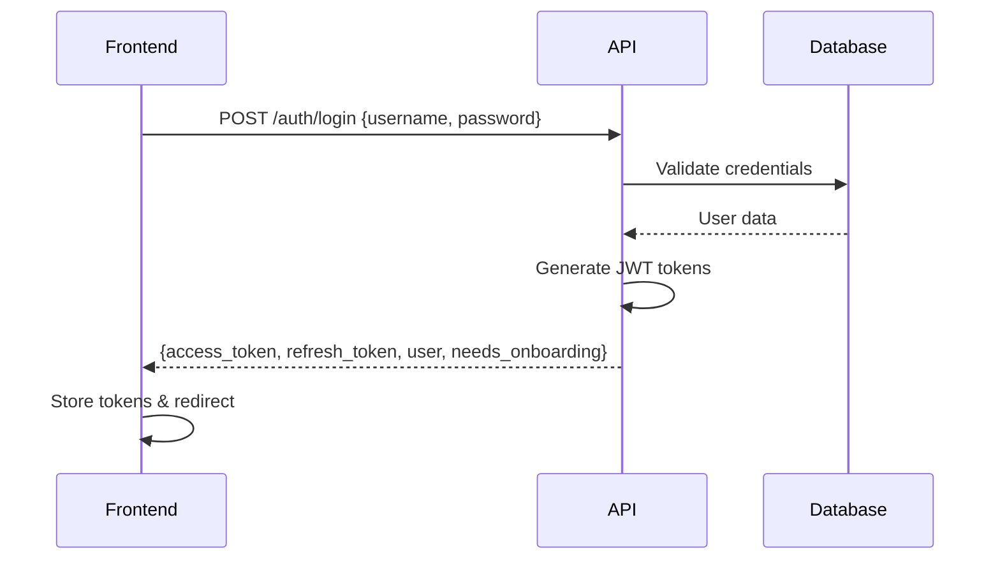
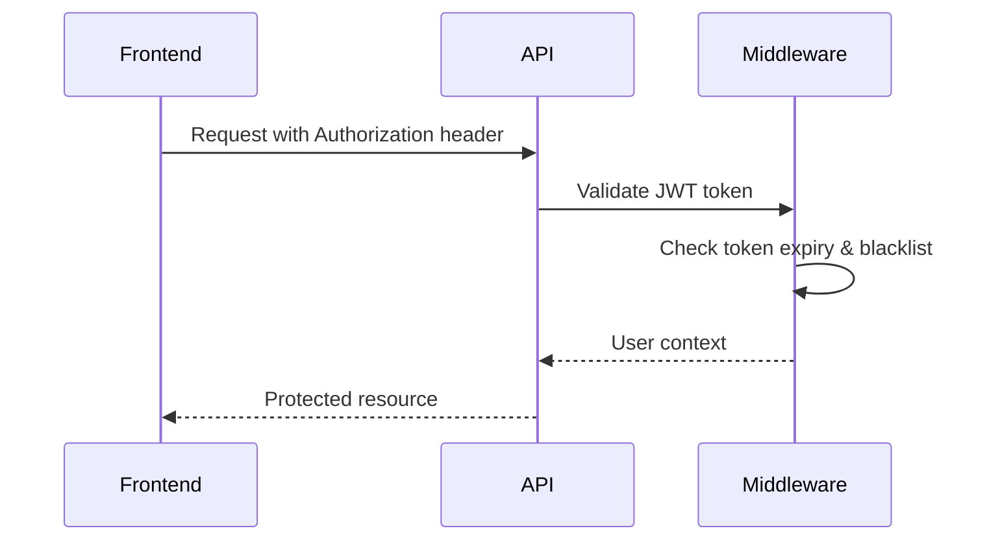
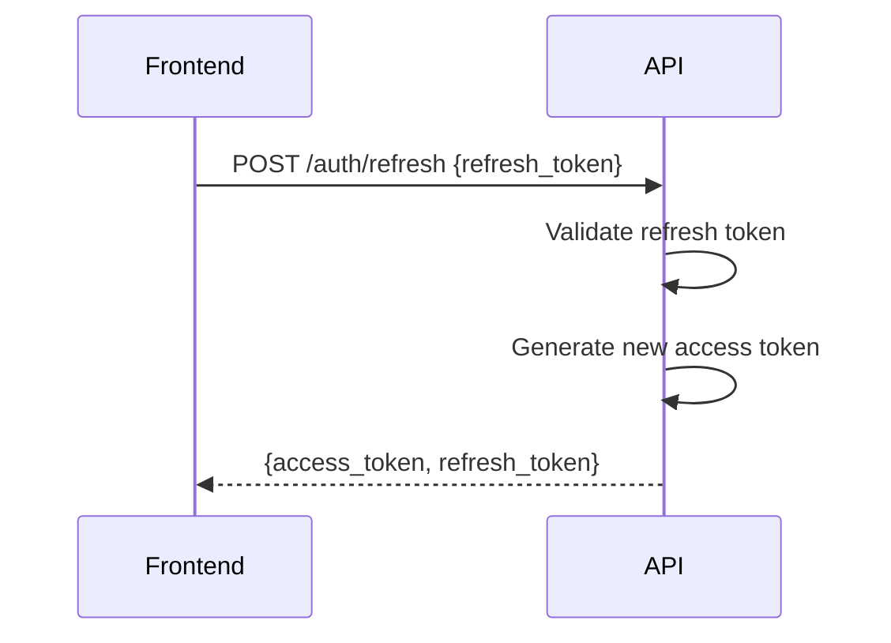

# Digame Authentication System Documentation

## Overview

The Digame platform uses a comprehensive JWT-based authentication system with dual backend architecture supporting both development and production environments. This guide covers the complete authentication setup, flows, API endpoints, and operational commands.

## Table of Contents

1. [Architecture Overview](#architecture-overview)
2. [Backend Setup](#backend-setup)
3. [Authentication Flows](#authentication-flows)
4. [API Endpoints](#api-endpoints)
5. [Frontend Integration](#frontend-integration)
6. [User Management](#user-management)
7. [Security Features](#security-features)
8. [Useful Commands](#useful-commands)
9. [Troubleshooting](#troubleshooting)
10. [Development Tips](#development-tips)

## Architecture Overview

### Dual Backend System

The Digame platform operates with two backend systems:

- **Python FastAPI Backend** (Port 8000) - Production-ready with comprehensive authentication
- **Node.js Express Backend** (Port 8001) - Development/legacy support

The frontend automatically detects and connects to the available backend, prioritizing the FastAPI backend.

### Key Components

- **JWT Token Handler** - Manages access and refresh tokens with 30-day expiration
- **Authentication Middleware** - Handles request authentication and security
- **User Management System** - Comprehensive user profiles with roles and permissions
- **Platform Owner System** - Special administrative access levels

## Backend Setup

### Prerequisites

```bash
# Python 3.11+ required
python --version

# Virtual environment setup
python -m venv venv
source venv/bin/activate  # On Windows: venv\Scripts\activate

# Install dependencies
pip install -r requirements.txt
```

### Environment Configuration

Create a `.env` file in the project root:

```env
# Database Configuration
DATABASE_URL=sqlite:///./digame.db

# Authentication Settings
SECRET_KEY=your-secret-key-here
ALGORITHM=HS256
ACCESS_TOKEN_EXPIRE_MINUTES=43200  # 30 days

# Security Settings
SECURITY_ENCRYPTION_KEY=your-encryption-key-here

# CORS Settings
CORS_ORIGINS=["http://localhost:3000", "http://localhost:3001"]
```

### Database Initialization

The system automatically creates database tables on startup. For manual initialization:

```bash
# Create Platform Owner user
python create_platform_owner.py

# Initialize authentication database
python -c "from app.auth.init_auth_db import init_auth_db; init_auth_db()"
```

### Starting the Backend

```bash
# Development mode with auto-reload
python -m uvicorn app.main:app --host 0.0.0.0 --port 8000 --reload

# Production mode
python -m uvicorn app.main:app --host 0.0.0.0 --port 8000
```

## Authentication Flows

### 1. User Login Flow



### 2. Token Validation Flow



### 3. Token Refresh Flow



## API Endpoints

### Authentication Endpoints

#### POST /auth/login
Authenticate user and return tokens.

**Request:**
```json
{
  "username": "user@example.com",
  "password": "password123"
}
```

**Response:**
```json
{
  "access_token": "eyJhbGciOiJIUzI1NiIsInR5cCI6IkpXVCJ9...",
  "refresh_token": "eyJhbGciOiJIUzI1NiIsInR5cCI6IkpXVCJ9...",
  "token_type": "bearer",
  "needs_onboarding": false,
  "user": {
    "id": 1,
    "username": "user",
    "email": "user@example.com",
    "first_name": "John",
    "last_name": "Doe",
    "is_active": true,
    "onboarding_completed": true
  }
}
```

#### GET /auth/profile
Get current user profile (requires authentication).

**Headers:**
```
Authorization: Bearer <access_token>
```

**Response:**
```json
{
  "id": 1,
  "username": "user",
  "email": "user@example.com",
  "first_name": "John",
  "last_name": "Doe",
  "is_active": true,
  "skills": [],
  "projects": [],
  "experience_entries": [],
  "education_entries": []
}
```

#### POST /auth/refresh
Refresh access token using refresh token.

**Request:**
```json
{
  "refresh_token": "eyJhbGciOiJIUzI1NiIsInR5cCI6IkpXVCJ9..."
}
```

**Response:**
```json
{
  "access_token": "eyJhbGciOiJIUzI1NiIsInR5cCI6IkpXVCJ9...",
  "refresh_token": "eyJhbGciOiJIUzI1NiIsInR5cCI6IkpXVCJ9...",
  "token_type": "bearer"
}
```

#### POST /auth/logout
Logout user and blacklist tokens.

**Request:**
```json
{
  "access_token": "eyJhbGciOiJIUzI1NiIsInR5cCI6IkpXVCJ9...",
  "refresh_token": "eyJhbGciOiJIUzI1NiIsInR5cCI6IkpXVCJ9..."
}
```

#### GET /auth/verify-token
Verify if current token is valid.

**Response:**
```json
{
  "valid": true,
  "user_id": 1,
  "username": "user"
}
```

### User Management Endpoints

#### POST /auth/register
Register a new user.

**Request:**
```json
{
  "username": "newuser",
  "email": "newuser@example.com",
  "password": "password123",
  "first_name": "Jane",
  "last_name": "Smith"
}
```

### Health Check Endpoints

#### GET /health
System health check.

**Response:**
```json
{
  "status": "healthy",
  "timestamp": "2025-01-21T15:25:00Z",
  "version": "1.0.0"
}
```

#### GET /service-info
Service information and capabilities.

**Response:**
```json
{
  "service": "Digame API",
  "version": "1.0.0",
  "environment": "development",
  "features": ["authentication", "user_management", "analytics"]
}
```

## Frontend Integration

### AuthContext Configuration

The frontend uses React Context for authentication state management:

```typescript
// Frontend authentication hook
const { user, tokens, isAuthenticated, login, logout } = useAuth();

// Login example
const handleLogin = async (credentials) => {
  const success = await login({
    username: credentials.email,
    password: credentials.password,
    rememberMe: credentials.rememberMe
  });
  
  if (success) {
    // Redirect to dashboard
    router.push('/dashboard');
  }
};
```

### Token Storage

- **Session Storage**: Default for temporary sessions
- **Local Storage**: Used when "Remember Me" is checked (30-day persistence)

### API Service Integration

```typescript
// Automatic token attachment
const response = await apiService.get('/auth/profile');

// Auto-detection of backend
// Tries http://localhost:8001 first, falls back to http://localhost:8000
```

## User Management

### Platform Owner System

Platform Owners have special administrative privileges:

- **Level 1**: Platform Admin - View analytics
- **Level 2**: Platform Super Admin - Manage users and tenants
- **Level 3**: Platform Owner - Full platform control

### Default Platform Owner

**Credentials:**
- Email: `philip.a.oshea@gmail.com`
- Password: `Dalk3y1306`
- Level: Platform Owner (Level 3)

### User Roles and Permissions

```python
# Permission levels
PERMISSIONS = {
    "free": ["basic_access"],
    "individual_pro": ["basic_access", "advanced_analytics"],
    "team": ["basic_access", "advanced_analytics", "team_collaboration"],
    "enterprise": ["all_features"],
    "platform_owner": ["*"]  # All permissions
}
```

## Security Features

### JWT Token Security

- **Algorithm**: HS256
- **Expiration**: 30 days (configurable)
- **Blacklisting**: Tokens can be invalidated
- **Refresh Mechanism**: Automatic token renewal

### Middleware Protection

- **Authentication Middleware**: Validates tokens on protected routes
- **Rate Limiting**: Prevents abuse (100 requests/minute default)
- **CORS Protection**: Configurable origin restrictions
- **Security Headers**: XSS, CSRF, and other protections

### Password Security

- **Hashing**: bcrypt with salt
- **Validation**: Configurable complexity requirements
- **Reset Mechanism**: Secure token-based password reset

## Useful Commands

### Development Commands

```bash
# Start backend in development mode
python -m uvicorn app.main:app --host 0.0.0.0 --port 8000 --reload

# Start frontend
npm run dev

# Create Platform Owner user
python create_platform_owner.py

# Test authentication endpoint
curl -X POST http://localhost:8000/auth/login \
  -H "Content-Type: application/json" \
  -d '{"username":"philip.a.oshea@gmail.com","password":"Dalk3y1306"}'
```

### Testing Commands

```bash
# Test login and get token
TOKEN=$(curl -s http://localhost:8000/auth/login \
  -X POST -H "Content-Type: application/json" \
  -d '{"username":"philip.a.oshea@gmail.com","password":"Dalk3y1306"}' \
  | jq -r '.access_token')

# Test authenticated endpoint
curl -s http://localhost:8000/auth/profile \
  -H "Authorization: Bearer $TOKEN" | jq .

# Test health check
curl http://localhost:8000/health | jq .

# Test service info
curl http://localhost:8000/service-info | jq .
```

### Database Commands

```bash
# Initialize database
python -c "from app.database import init_db; init_db()"

# Create tables
python -c "from app.database import engine; from app.models import Base; Base.metadata.create_all(engine)"

# Reset database (careful!)
rm digame.db && python create_platform_owner.py
```

### Docker Commands

```bash
# Build and start services
docker-compose up --build

# Start in production mode
docker-compose -f docker-compose.prod.yml up

# View logs
docker-compose logs -f api

# Reset containers
docker-compose down -v && docker-compose up --build
```

## Troubleshooting

### Common Issues

#### 1. "Login failed" Error
**Symptoms**: Frontend shows login failed message
**Causes**: 
- Backend not running
- Wrong credentials
- Database connection issues

**Solutions**:
```bash
# Check backend status
curl http://localhost:8000/health

# Verify Platform Owner exists
python create_platform_owner.py

# Check logs
tail -f logs/app.log
```

#### 2. Token Validation Errors
**Symptoms**: "Could not validate credentials"
**Causes**:
- Expired tokens
- Invalid secret key
- Token blacklisted

**Solutions**:
```bash
# Check token expiry
python -c "
import jwt
token = 'your-token-here'
payload = jwt.decode(token, options={'verify_signature': False})
print(payload)
"

# Refresh tokens
curl -X POST http://localhost:8000/auth/refresh \
  -H "Content-Type: application/json" \
  -d '{"refresh_token":"your-refresh-token"}'
```

#### 3. CORS Issues
**Symptoms**: Browser blocks requests
**Solutions**:
- Check CORS_ORIGINS in environment
- Verify frontend URL matches allowed origins
- Use proper headers in requests

#### 4. Database Connection Issues
**Symptoms**: "Could not connect to database"
**Solutions**:
```bash
# Check database file
ls -la digame.db

# Recreate database
python create_platform_owner.py

# Check database URL in .env
echo $DATABASE_URL
```

### Debug Mode

Enable debug logging:

```python
# In app/main.py
import logging
logging.basicConfig(level=logging.DEBUG)
```

### Log Analysis

```bash
# View authentication logs
grep "auth" logs/app.log

# View error logs
grep "ERROR" logs/app.log

# Monitor real-time logs
tail -f logs/app.log | grep -E "(auth|error|login)"
```

## Development Tips

### 1. Environment Setup

```bash
# Use environment variables for configuration
export SECRET_KEY="your-secret-key"
export DATABASE_URL="sqlite:///./digame.db"

# Or use .env file
echo "SECRET_KEY=your-secret-key" >> .env
```

### 2. Testing Authentication

```bash
# Quick login test
make test-login

# Full authentication flow test
make test-auth-flow

# Load testing
make load-test-auth
```

### 3. Frontend Development

```typescript
// Use environment variables for API URLs
const API_BASE_URL = process.env.NEXT_PUBLIC_API_URL || 'http://localhost:8000';

// Handle authentication state
useEffect(() => {
  if (!isAuthenticated && !isLoading) {
    router.push('/login');
  }
}, [isAuthenticated, isLoading]);
```

### 4. Security Best Practices

- Always use HTTPS in production
- Rotate secret keys regularly
- Monitor failed login attempts
- Implement rate limiting
- Use secure cookie settings
- Validate all input data

### 5. Performance Optimization

```python
# Use connection pooling
DATABASE_URL = "sqlite:///./digame.db?pool_size=20&max_overflow=0"

# Cache frequently accessed data
from functools import lru_cache

@lru_cache(maxsize=128)
def get_user_permissions(user_id: int):
    # Cached permission lookup
    pass
```

## API Documentation

The complete API documentation is available at:
- **Development**: http://localhost:8000/docs
- **ReDoc**: http://localhost:8000/redoc

## Support

For authentication-related issues:

1. Check this documentation
2. Review server logs
3. Test with curl commands
4. Verify environment configuration
5. Check database connectivity

## Version History

- **v1.0.0**: Initial authentication system
- **v1.1.0**: Added Platform Owner system
- **v1.2.0**: Enhanced security middleware
- **v1.3.0**: Dual backend support
- **v1.4.0**: Extended token expiration (30 days)

---

*Last updated: January 21, 2025*
*For technical support, contact the development team.*