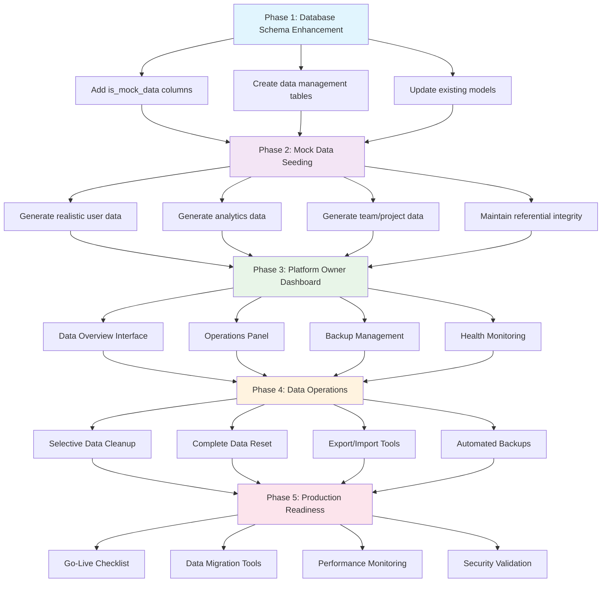
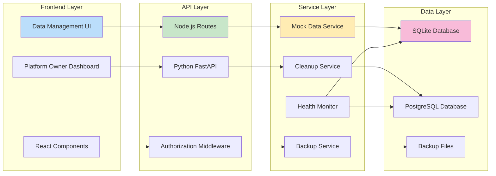

# Data Management System Implementation Request

## Objective
Create a comprehensive data management system that allows seamless transition from mock/demo data to real production data, with platform owner controls for data lifecycle management.

## Core Requirements

### 1. Mock-to-Real Data Transition System
- **Database Seeding**: Implement a seeding system that can populate the database with realistic mock data for development and demo purposes
- **Data Source Flagging**: Add metadata to distinguish between mock data and real user-generated data
- **Gradual Migration**: Allow real data to coexist with mock data during transition periods
- **Data Validation**: Ensure mock data follows the same schema and validation rules as real data

### 2. Platform Owner Data Management Dashboard
Create a dedicated admin interface with the following capabilities:

#### Data Overview Section
- **Data Statistics**: Display counts of mock vs real data across all entities (users, projects, integrations, etc.)
- **Data Health Metrics**: Show data quality indicators and potential issues
- **Storage Usage**: Display database size and growth trends

#### Data Control Actions
- **Selective Data Removal**: 
  - Remove only mock data while preserving real user data
  - Remove data by date ranges or specific criteria
  - Remove data by entity type (users, projects, logs, etc.)
- **Complete Data Reset**: Nuclear option to wipe all data for fresh production start
- **Data Export**: Backup capabilities before major data operations
- **Data Import**: Ability to restore from backups or import production datasets

#### Safety Features
- **Confirmation Workflows**: Multi-step confirmation for destructive operations
- **Backup Automation**: Automatic backups before any data deletion
- **Audit Logging**: Track all data management operations with timestamps and user attribution
- **Rollback Capability**: Ability to undo recent data operations within a time window

### 3. Technical Implementation Areas

#### Backend Components
- **Data Service Layer**: Create services for data lifecycle management
- **Migration Scripts**: Database migration tools for schema and data updates
- **Seeding System**: Configurable mock data generation with realistic patterns
- **API Endpoints**: RESTful endpoints for data management operations
- **Background Jobs**: Queue system for large data operations

#### Frontend Components
- **Admin Dashboard**: Comprehensive UI for data management operations
- **Data Visualization**: Charts and graphs showing data distribution and health
- **Operation Status**: Real-time feedback on long-running data operations
- **Confirmation Modals**: User-friendly interfaces for destructive operations

#### Database Considerations
- **Data Flagging**: Add `is_mock_data` boolean fields to relevant tables
- **Soft Deletes**: Implement soft deletion for recovery capabilities
- **Indexing**: Optimize queries for data type filtering and bulk operations
- **Constraints**: Ensure referential integrity during data operations

### 4. Specific Features to Implement

#### Mock Data Management
- **Realistic Data Generation**: Create mock data that resembles real usage patterns
- **Configurable Volumes**: Allow adjustment of mock data quantities
- **Relationship Integrity**: Ensure mock data maintains proper foreign key relationships
- **Temporal Consistency**: Generate mock data with realistic timestamps and sequences

#### Production Readiness Tools
- **Go-Live Checklist**: Automated verification of system readiness
- **Data Migration Validation**: Verify data integrity after operations
- **Performance Impact Assessment**: Monitor system performance during data operations
- **User Communication**: Notify users of maintenance windows and data changes

#### Monitoring and Alerting
- **Operation Monitoring**: Track progress of long-running data operations
- **Error Handling**: Graceful handling of data operation failures
- **Success Notifications**: Confirm completion of data management tasks
- **System Health Checks**: Verify system stability after major data changes

### 5. User Experience Considerations

#### Platform Owner Interface
- **Intuitive Navigation**: Clear organization of data management features
- **Visual Feedback**: Progress indicators and status updates
- **Help Documentation**: In-app guidance for data management procedures
- **Risk Indicators**: Clear warnings for potentially destructive operations

#### End User Impact
- **Minimal Disruption**: Design operations to minimize user-facing downtime
- **Data Continuity**: Ensure user experience remains consistent during transitions
- **Communication**: Provide clear messaging about system changes

### 6. Security and Compliance
- **Access Controls**: Restrict data management features to authorized platform owners
- **Audit Trails**: Comprehensive logging of all data operations
- **Data Privacy**: Ensure compliance with data protection regulations
- **Secure Deletion**: Implement secure data wiping for sensitive information

## Implementation Priority
1. **Phase 1**: Basic mock data seeding and flagging system
2. **Phase 2**: Platform owner dashboard with basic data management
3. **Phase 3**: Advanced features like selective deletion and rollback
4. **Phase 4**: Monitoring, alerting, and production readiness tools

## Success Criteria
- Platform owners can easily distinguish between mock and real data
- Complete data reset can be performed safely with proper safeguards
- System maintains performance and stability during data operations
- All data operations are fully auditable and reversible when possible
- Transition from development to production is seamless and risk-free

This system will provide the flexibility needed for development and testing while ensuring a clean, professional production environment when ready for go-live.

---

# COMPREHENSIVE IMPLEMENTATION PLAN

## Implementation Flow Diagram



## Data Flow Architecture



## Phase 1: Database Schema Enhancement & Mock Data Flagging

### 1.1 Database Schema Updates

#### 🏗️ **Schema Design**
Building on the existing comprehensive database architecture documented in [`docs/database/DATABASE.md`](docs/database/DATABASE.md), we'll enhance the current **18-table schema** with mock data management capabilities:

- **18+ Existing Tables**: Complete schema for notifications, tasks, projects, teams, workflows, analytics, security, reports, and platform features
- **Proper Relationships**: Foreign keys and indexes for optimal performance
- **Sample Data**: Comprehensive seeding for realistic testing and development (150+ records)
- **Multi-Environment Support**: SQLite (current) → PostgreSQL → Enterprise ready

#### 🚀 **Deployment Flexibility**
Leveraging the existing multi-environment architecture:

- **Current SQLite**: Zero-configuration development (recommended to continue)
- **Docker Development**: PostgreSQL + Redis ready for team collaboration
- **Docker Production**: Enterprise stack with full monitoring

#### Database Schema Coverage
The updated schema now supports all implemented platform features:

| Feature Category | Backend Routes | Database Tables | Status |
|------------------|----------------|-----------------|---------|
| **Core Platform** | auth.js, settings.js | users, notification_settings | ✅ Ready |
| **Notifications** | notifications.js | notifications, notification_settings | 🔧 Schema Prepared |
| **Task Management** | tasks.js | tasks, projects | 🔧 Schema Prepared |
| **Team Collaboration** | team.js, teams.js | teams, team_members, skills, user_skills | 🔧 Schema Prepared |
| **Workflow Automation** | workflow.js | workflows | 🔧 Schema Prepared |
| **Analytics** | analytics.js | analytics_events | 🔧 Schema Prepared |
| **Security & Compliance** | security.js | audit_logs, api_keys, webhooks | 🔧 Schema Prepared |
| **Reports & Publishing** | reports.js | reports | 🔧 Schema Prepared |
| **Platform Owner** | platform-owner.js | platform_metrics, tenants | 🔧 Schema Prepared |

#### Backend Database Schema Changes (SQLite - Node.js)
**Building on Existing Extended Schema**: [`backend/src/services/database.js`](backend/src/services/database.js)

```sql
-- Add is_mock_data columns to ALL existing tables (18 tables total)
ALTER TABLE users ADD COLUMN is_mock_data BOOLEAN DEFAULT FALSE;
ALTER TABLE notifications ADD COLUMN is_mock_data BOOLEAN DEFAULT FALSE;
ALTER TABLE notification_settings ADD COLUMN is_mock_data BOOLEAN DEFAULT FALSE;
ALTER TABLE tasks ADD COLUMN is_mock_data BOOLEAN DEFAULT FALSE;
ALTER TABLE projects ADD COLUMN is_mock_data BOOLEAN DEFAULT FALSE;
ALTER TABLE workflows ADD COLUMN is_mock_data BOOLEAN DEFAULT FALSE;
ALTER TABLE teams ADD COLUMN is_mock_data BOOLEAN DEFAULT FALSE;
ALTER TABLE team_members ADD COLUMN is_mock_data BOOLEAN DEFAULT FALSE;
ALTER TABLE skills ADD COLUMN is_mock_data BOOLEAN DEFAULT FALSE;
ALTER TABLE user_skills ADD COLUMN is_mock_data BOOLEAN DEFAULT FALSE;
ALTER TABLE mentorship_relationships ADD COLUMN is_mock_data BOOLEAN DEFAULT FALSE;
ALTER TABLE analytics_events ADD COLUMN is_mock_data BOOLEAN DEFAULT FALSE;
ALTER TABLE reports ADD COLUMN is_mock_data BOOLEAN DEFAULT FALSE;
ALTER TABLE audit_logs ADD COLUMN is_mock_data BOOLEAN DEFAULT FALSE;
ALTER TABLE api_keys ADD COLUMN is_mock_data BOOLEAN DEFAULT FALSE;
ALTER TABLE webhooks ADD COLUMN is_mock_data BOOLEAN DEFAULT FALSE;
ALTER TABLE platform_metrics ADD COLUMN is_mock_data BOOLEAN DEFAULT FALSE;
ALTER TABLE tenants ADD COLUMN is_mock_data BOOLEAN DEFAULT FALSE;

-- Add mock data categorization
ALTER TABLE users ADD COLUMN mock_data_category TEXT DEFAULT NULL; -- 'demo', 'test', 'development'
ALTER TABLE users ADD COLUMN mock_data_created_at TEXT DEFAULT NULL;

-- Create data_management_operations table
CREATE TABLE IF NOT EXISTS data_management_operations (
    id INTEGER PRIMARY KEY AUTOINCREMENT,
    operation_uuid TEXT UNIQUE NOT NULL,
    operation_type TEXT NOT NULL, -- 'seed', 'cleanup', 'reset', 'export', 'import'
    entity_types TEXT, -- JSON array of affected entity types
    status TEXT DEFAULT 'pending', -- 'pending', 'running', 'completed', 'failed'
    started_at TEXT,
    completed_at TEXT,
    affected_records INTEGER DEFAULT 0,
    error_message TEXT,
    backup_path TEXT,
    triggered_by_user_id INTEGER,
    metadata TEXT DEFAULT '{}', -- JSON for additional operation details
    created_at TEXT DEFAULT CURRENT_TIMESTAMP,
    FOREIGN KEY (triggered_by_user_id) REFERENCES users(id) ON DELETE SET NULL
);

-- Create data_backups table
CREATE TABLE IF NOT EXISTS data_backups (
    id INTEGER PRIMARY KEY AUTOINCREMENT,
    backup_uuid TEXT UNIQUE NOT NULL,
    backup_type TEXT NOT NULL, -- 'full', 'partial', 'pre_operation'
    file_path TEXT NOT NULL,
    file_size_bytes INTEGER,
    entity_counts TEXT DEFAULT '{}', -- JSON object with counts per entity type
    created_by_user_id INTEGER,
    created_at TEXT DEFAULT CURRENT_TIMESTAMP,
    expires_at TEXT,
    FOREIGN KEY (created_by_user_id) REFERENCES users(id) ON DELETE SET NULL
);

-- Performance indexes for mock data queries
CREATE INDEX IF NOT EXISTS idx_users_mock_data ON users(is_mock_data);
CREATE INDEX IF NOT EXISTS idx_notifications_mock_data ON notifications(is_mock_data);
CREATE INDEX IF NOT EXISTS idx_tasks_mock_data ON tasks(is_mock_data);
CREATE INDEX IF NOT EXISTS idx_teams_mock_data ON teams(is_mock_data);
CREATE INDEX IF NOT EXISTS idx_analytics_events_mock_data ON analytics_events(is_mock_data);
CREATE INDEX IF NOT EXISTS idx_data_operations_status ON data_management_operations(status);
CREATE INDEX IF NOT EXISTS idx_data_operations_type ON data_management_operations(operation_type);
```

#### Python Database Schema Changes (SQLAlchemy)
**Files to Update:**
- [`app/models/user.py`](app/models/user.py:1) - Add `is_mock_data` column
- [`app/models/team.py`](app/models/team.py:1) - Add `is_mock_data` column
- [`app/models/analytics.py`](app/models/analytics.py:1) - Add `is_mock_data` to all analytics models
- Create new models: `app/models/data_management.py`

```python
# Add to ALL existing models (18+ models)
is_mock_data = Column(Boolean, default=False, nullable=False, index=True)
mock_data_category = Column(String(100), nullable=True)  # 'demo', 'test', 'development'
mock_data_created_at = Column(DateTime, nullable=True)

# New DataManagementOperation model
class DataManagementOperation(Base):
    __tablename__ = "data_management_operations"
    
    id = Column(Integer, primary_key=True, index=True)
    operation_uuid = Column(String(36), unique=True, index=True, default=lambda: str(uuid.uuid4()))
    operation_type = Column(String(50), nullable=False)
    entity_types = Column(JSON, default=[])
    status = Column(String(50), default="pending")
    started_at = Column(DateTime, nullable=True)
    completed_at = Column(DateTime, nullable=True)
    affected_records = Column(Integer, default=0)
    error_message = Column(Text, nullable=True)
    backup_path = Column(String(512), nullable=True)
    triggered_by_user_id = Column(Integer, ForeignKey("users.id"), nullable=True)
    metadata = Column(JSON, default={})
    created_at = Column(DateTime, default=datetime.utcnow)

class DataBackup(Base):
    __tablename__ = "data_backups"
    
    id = Column(Integer, primary_key=True, index=True)
    backup_uuid = Column(String(36), unique=True, index=True, default=lambda: str(uuid.uuid4()))
    backup_type = Column(String(50), nullable=False)
    file_path = Column(String(512), nullable=False)
    file_size_bytes = Column(Integer, nullable=True)
    entity_counts = Column(JSON, default={})
    created_by_user_id = Column(Integer, ForeignKey("users.id"), nullable=True)
    created_at = Column(DateTime, default=datetime.utcnow)
    expires_at = Column(DateTime, nullable=True)
```

#### 🔧 **Enhanced Infrastructure Integration**
Building on the existing database abstraction layer and migration tools:

- **Database Abstraction Layer**: [`backend/src/services/databaseAdapter.js`](backend/src/services/databaseAdapter.js) - Ready for multi-environment support
- **Migration Tools**: [`backend/src/utils/databaseMigrator.js`](backend/src/utils/databaseMigrator.js) - Complete data migration capabilities
- **Multi-Layer Caching**: [`backend/src/services/cacheManager.js`](backend/src/services/cacheManager.js) - Memory + Redis intelligent caching
- **Health Monitoring**: [`backend/src/routes/health.js`](backend/src/routes/health.js) - 9 comprehensive health endpoints
- **CLI Tools**: [`backend/scripts/database-cli.js`](backend/scripts/database-cli.js) - Professional database management

### 1.2 Mock Data Seeding System

#### Backend Seeding Service
**New File:** [`backend/src/services/mockDataService.js`](backend/src/services/mockDataService.js)
```javascript
class MockDataService {
    async seedMockUsers(count = 50) { /* Implementation */ }
    async seedMockTeams(count = 10) { /* Implementation */ }
    async seedMockProjects(count = 25) { /* Implementation */ }
    async seedMockAnalytics(count = 100) { /* Implementation */ }
    async generateRealisticTimestamps() { /* Implementation */ }
    async maintainReferentialIntegrity() { /* Implementation */ }
}
```

#### Python Seeding Service
**New File:** [`app/services/mock_data_service.py`](app/services/mock_data_service.py)
```python
class MockDataService:
    def seed_mock_users(self, count: int = 50) -> List[User]:
        """Generate realistic mock users with proper relationships"""
    
    def seed_mock_analytics(self, count: int = 100) -> List[AnalyticsModel]:
        """Generate mock analytics data with realistic patterns"""
    
    def seed_mock_performance_metrics(self, count: int = 200) -> List[PerformanceMetric]:
        """Generate mock performance data with trends"""
```

## Phase 2: Platform Owner Data Management Dashboard

### 2.1 Backend API Endpoints

#### Node.js Routes
**New File:** [`backend/src/routes/dataManagement.js`](backend/src/routes/dataManagement.js)
```javascript
// GET /api/data-management/overview
// GET /api/data-management/statistics
// POST /api/data-management/seed
// POST /api/data-management/cleanup
// POST /api/data-management/reset
// POST /api/data-management/export
// POST /api/data-management/import
// GET /api/data-management/operations
// GET /api/data-management/backups
```

#### Python FastAPI Routes
**New File:** [`app/routers/data_management.py`](app/routers/data_management.py)
```python
@router.get("/overview")
async def get_data_overview():
    """Get comprehensive data statistics and health metrics"""

@router.post("/operations/seed")
async def seed_mock_data(request: SeedDataRequest):
    """Seed database with mock data"""

@router.post("/operations/cleanup")
async def cleanup_data(request: CleanupDataRequest):
    """Remove mock data or data by criteria"""
```

### 2.2 Frontend Data Management Interface

#### New Platform Owner Page
**New File:** [`frontend/pages/platform-owner/data-management.js`](frontend/pages/platform-owner/data-management.js)

**Key Components to Create:**
- [`frontend/src/components/platform-owner/DataOverviewDashboard.jsx`](frontend/src/components/platform-owner/DataOverviewDashboard.jsx)
- [`frontend/src/components/platform-owner/DataStatisticsCards.jsx`](frontend/src/components/platform-owner/DataStatisticsCards.jsx)
- [`frontend/src/components/platform-owner/DataOperationsPanel.jsx`](frontend/src/components/platform-owner/DataOperationsPanel.jsx)
- [`frontend/src/components/platform-owner/DataBackupManager.jsx`](frontend/src/components/platform-owner/DataBackupManager.jsx)
- [`frontend/src/components/platform-owner/ConfirmationModal.jsx`](frontend/src/components/platform-owner/ConfirmationModal.jsx)

#### Data Visualization Components
**New Files:**
- [`frontend/src/components/platform-owner/DataHealthMetrics.jsx`](frontend/src/components/platform-owner/DataHealthMetrics.jsx)
- [`frontend/src/components/platform-owner/DataDistributionChart.jsx`](frontend/src/components/platform-owner/DataDistributionChart.jsx)
- [`frontend/src/components/platform-owner/OperationStatusTracker.jsx`](frontend/src/components/platform-owner/OperationStatusTracker.jsx)

### 2.3 Navigation Integration

#### Update Navigation Component
**File to Update:** [`frontend/src/components/navigation/NextJSComprehensiveNavigation.tsx`](frontend/src/components/navigation/NextJSComprehensiveNavigation.tsx:1)

Add to Platform Owner section:
```typescript
{
  name: 'Data Management',
  href: '/platform-owner/data-management',
  icon: Database,
  description: 'Manage mock data and production readiness'
}
```

## Phase 3: Data Management Features Implementation

### 3.1 Mock Data Generation

#### Realistic Data Patterns
**Files to Create:**
- [`backend/src/utils/mockDataGenerators.js`](backend/src/utils/mockDataGenerators.js)
- [`app/utils/mock_data_generators.py`](app/utils/mock_data_generators.py)

**Data Generation Categories:**
- **User Data**: Realistic names, emails, roles, subscription tiers
- **Team Data**: Company-like team structures with proper hierarchies
- **Analytics Data**: Time-series data with realistic trends and seasonality
- **Performance Metrics**: KPIs with logical correlations and benchmarks
- **Activity Data**: User interactions following realistic usage patterns

### 3.2 Data Cleanup Operations

#### Selective Data Removal
**Backend Services:**
- [`backend/src/services/dataCleanupService.js`](backend/src/services/dataCleanupService.js)
- [`app/services/data_cleanup_service.py`](app/services/data_cleanup_service.py)

**Cleanup Operations:**
- Remove only mock data (preserve real user data)
- Remove data by date ranges
- Remove data by entity type
- Remove data by subscription tier
- Remove inactive/test accounts

### 3.3 Backup and Recovery System

#### Automated Backup Service
**Files to Create:**
- [`backend/src/services/backupService.js`](backend/src/services/backupService.js)
- [`app/services/backup_service.py`](app/services/backup_service.py)

**Backup Features:**
- Pre-operation automatic backups
- Scheduled full system backups
- Selective entity backups
- Backup compression and encryption
- Backup retention policies

## Phase 4: Advanced Features & Production Readiness

### 4.1 Data Migration Tools

#### Migration Scripts
**New Directory:** [`scripts/data-migration/`](scripts/data-migration/)
- `migrate_mock_to_production.py`
- `validate_data_integrity.py`
- `generate_migration_report.py`

### 4.2 Monitoring and Alerting

#### Data Health Monitoring
**Files to Create:**
- [`backend/src/services/dataHealthMonitor.js`](backend/src/services/dataHealthMonitor.js)
- [`app/services/data_health_monitor.py`](app/services/data_health_monitor.py)

**Monitoring Features:**
- Data quality metrics
- Storage usage tracking
- Performance impact assessment
- Anomaly detection in data patterns

### 4.3 Go-Live Preparation Tools

#### Production Readiness Checklist
**New File:** [`frontend/src/components/platform-owner/GoLiveChecklist.jsx`](frontend/src/components/platform-owner/GoLiveChecklist.jsx)

**Checklist Items:**
- [ ] All mock data identified and flagged
- [ ] Real user data validated
- [ ] Backup systems tested
- [ ] Performance benchmarks established
- [ ] Security audit completed
- [ ] Data retention policies configured

## Implementation Checklist

### Backend Files to Create/Update

#### Node.js Backend
- [ ] [`backend/src/models/DataManagement.js`](backend/src/models/DataManagement.js) - New data management models
- [ ] [`backend/src/services/mockDataService.js`](backend/src/services/mockDataService.js) - Mock data generation
- [ ] [`backend/src/services/dataCleanupService.js`](backend/src/services/dataCleanupService.js) - Data cleanup operations
- [ ] [`backend/src/services/backupService.js`](backend/src/services/backupService.js) - Backup management
- [ ] [`backend/src/services/dataHealthMonitor.js`](backend/src/services/dataHealthMonitor.js) - Health monitoring
- [ ] [`backend/src/routes/dataManagement.js`](backend/src/routes/dataManagement.js) - API endpoints
- [ ] [`backend/src/utils/mockDataGenerators.js`](backend/src/utils/mockDataGenerators.js) - Data generators
- [ ] [`backend/src/middleware/dataManagementAuth.js`](backend/src/middleware/dataManagementAuth.js) - Authorization middleware

#### Python Backend
- [ ] [`app/models/data_management.py`](app/models/data_management.py) - SQLAlchemy models
- [ ] [`app/services/mock_data_service.py`](app/services/mock_data_service.py) - Mock data service
- [ ] [`app/services/data_cleanup_service.py`](app/services/data_cleanup_service.py) - Cleanup service
- [ ] [`app/services/backup_service.py`](app/services/backup_service.py) - Backup service
- [ ] [`app/services/data_health_monitor.py`](app/services/data_health_monitor.py) - Health monitoring
- [ ] [`app/routers/data_management.py`](app/routers/data_management.py) - FastAPI routes
- [ ] [`app/utils/mock_data_generators.py`](app/utils/mock_data_generators.py) - Data generators
- [ ] [`app/crud/data_management.py`](app/crud/data_management.py) - CRUD operations

#### Database Migrations
- [ ] [`migrations/versions/add_mock_data_flags.py`](migrations/versions/add_mock_data_flags.py) - Add is_mock_data columns
- [ ] [`migrations/versions/create_data_management_tables.py`](migrations/versions/create_data_management_tables.py) - New tables
- [ ] [`backend/scripts/add_mock_data_columns.sql`](backend/scripts/add_mock_data_columns.sql) - SQLite migrations

### Frontend Files to Create/Update

#### Main Pages
- [ ] [`frontend/pages/platform-owner/data-management.js`](frontend/pages/platform-owner/data-management.js) - Main data management page

#### Core Components
- [ ] [`frontend/src/components/platform-owner/DataOverviewDashboard.jsx`](frontend/src/components/platform-owner/DataOverviewDashboard.jsx) - Overview dashboard
- [ ] [`frontend/src/components/platform-owner/DataStatisticsCards.jsx`](frontend/src/components/platform-owner/DataStatisticsCards.jsx) - Statistics display
- [ ] [`frontend/src/components/platform-owner/DataOperationsPanel.jsx`](frontend/src/components/platform-owner/DataOperationsPanel.jsx) - Operations interface
- [ ] [`frontend/src/components/platform-owner/DataBackupManager.jsx`](frontend/src/components/platform-owner/DataBackupManager.jsx) - Backup management
- [ ] [`frontend/src/components/platform-owner/ConfirmationModal.jsx`](frontend/src/components/platform-owner/ConfirmationModal.jsx) - Confirmation dialogs

#### Visualization Components
- [ ] [`frontend/src/components/platform-owner/DataHealthMetrics.jsx`](frontend/src/components/platform-owner/DataHealthMetrics.jsx) - Health metrics
- [ ] [`frontend/src/components/platform-owner/DataDistributionChart.jsx`](frontend/src/components/platform-owner/DataDistributionChart.jsx) - Data distribution
- [ ] [`frontend/src/components/platform-owner/OperationStatusTracker.jsx`](frontend/src/components/platform-owner/OperationStatusTracker.jsx) - Operation tracking
- [ ] [`frontend/src/components/platform-owner/GoLiveChecklist.jsx`](frontend/src/components/platform-owner/GoLiveChecklist.jsx) - Go-live preparation

#### Utility Components
- [ ] [`frontend/src/components/platform-owner/DataExportDialog.jsx`](frontend/src/components/platform-owner/DataExportDialog.jsx) - Export interface
- [ ] [`frontend/src/components/platform-owner/DataImportDialog.jsx`](frontend/src/components/platform-owner/DataImportDialog.jsx) - Import interface
- [ ] [`frontend/src/components/platform-owner/ProgressIndicator.jsx`](frontend/src/components/platform-owner/ProgressIndicator.jsx) - Progress tracking

#### Services and Utilities
- [ ] [`frontend/src/services/dataManagementApi.js`](frontend/src/services/dataManagementApi.js) - API client
- [ ] [`frontend/src/hooks/useDataManagement.js`](frontend/src/hooks/useDataManagement.js) - React hooks
- [ ] [`frontend/src/utils/dataValidation.js`](frontend/src/utils/dataValidation.js) - Data validation utilities

#### Navigation Updates
- [ ] [`frontend/src/components/navigation/NextJSComprehensiveNavigation.tsx`](frontend/src/components/navigation/NextJSComprehensiveNavigation.tsx:1) - Add data management menu item

### Scripts and Utilities
- [ ] [`scripts/data-migration/migrate_mock_to_production.py`](scripts/data-migration/migrate_mock_to_production.py) - Migration script
- [ ] [`scripts/data-migration/validate_data_integrity.py`](scripts/data-migration/validate_data_integrity.py) - Validation script
- [ ] [`scripts/data-migration/generate_migration_report.py`](scripts/data-migration/generate_migration_report.py) - Reporting script
- [ ] [`scripts/backup-restore/create_backup.py`](scripts/backup-restore/create_backup.py) - Backup creation
- [ ] [`scripts/backup-restore/restore_backup.py`](scripts/backup-restore/restore_backup.py) - Backup restoration

## Data Per Page Analysis

### Current Pages with Mock Data Requirements

#### Analytics Pages
- [`frontend/pages/analytics/advanced.js`](frontend/pages/analytics/advanced.js) - **Mock Data**: Performance metrics, predictive models, ROI calculations
- [`frontend/pages/analytics/behavioral.js`](frontend/pages/analytics/behavioral.js) - **Mock Data**: User behavior patterns, activity logs
- [`frontend/pages/analytics/predictive.js`](frontend/pages/analytics/predictive.js) - **Mock Data**: Prediction models, forecast data
- [`frontend/pages/analytics/platform.js`](frontend/pages/analytics/platform.js) - **Mock Data**: Platform-wide metrics, usage statistics

#### Admin Pages
- [`frontend/pages/admin/users.js`](frontend/pages/admin/users.js) - **Mock Data**: User accounts, roles, permissions
- [`frontend/pages/admin/monitoring.js`](frontend/pages/admin/monitoring.js) - **Mock Data**: System metrics, performance data
- [`frontend/pages/admin/dashboard.js`](frontend/pages/admin/dashboard.js) - **Mock Data**: Admin KPIs, system health

#### Team Pages
- [`frontend/pages/team/dashboard.js`](frontend/pages/team/dashboard.js) - **Mock Data**: Team performance, collaboration metrics
- [`frontend/pages/team/skills.js`](frontend/pages/team/skills.js) - **Mock Data**: Skill assessments, gap analysis
- [`frontend/pages/team/workflows.js`](frontend/pages/team/workflows.js) - **Mock Data**: Workflow efficiency, optimization suggestions

#### Enterprise Pages
- [`frontend/pages/enterprise/advanced-analytics.js`](frontend/pages/enterprise/advanced-analytics.js) - **Mock Data**: Enterprise metrics, multi-tenant data
- [`frontend/pages/enterprise/market-intel.js`](frontend/pages/enterprise/market-intel.js) - **Mock Data**: Market analysis, competitive intelligence

#### Platform Owner Pages
- [`frontend/pages/platform-owner/console.js`](frontend/pages/platform-owner/console.js) - **Mock Data**: Platform metrics, tenant statistics
- [`frontend/pages/platform-owner/revenue.js`](frontend/pages/platform-owner/revenue.js) - **Mock Data**: Revenue analytics, subscription data
- [`frontend/pages/platform-owner/health.js`](frontend/pages/platform-owner/health.js) - **Mock Data**: System health, performance monitoring

## Implementation Timeline

### Week 1-2: Foundation
- Database schema updates
- Basic mock data flagging
- Core data management models

### Week 3-4: Backend Services
- Mock data generation services
- Data cleanup operations
- Basic API endpoints

### Week 5-6: Frontend Interface
- Data management dashboard
- Basic operations interface
- Navigation integration

### Week 7-8: Advanced Features
- Backup and recovery system
- Data health monitoring
- Go-live preparation tools

### Week 9-10: Testing & Polish
- Comprehensive testing
- Performance optimization
- Documentation completion

## Success Metrics

- [ ] 100% of mock data properly flagged and identifiable
- [ ] Complete data reset can be performed in under 5 minutes
- [ ] All data operations are fully auditable with detailed logs
- [ ] Zero data loss during cleanup operations (with proper backups)
- [ ] Platform owners can distinguish mock vs real data at a glance
- [ ] Go-live process reduces setup time by 80%
- [ ] Data integrity maintained across all operations

This comprehensive implementation plan provides a clear roadmap for creating a robust data management system that enables seamless transition from development to production while maintaining data integrity and providing platform owners with complete control over their data lifecycle.