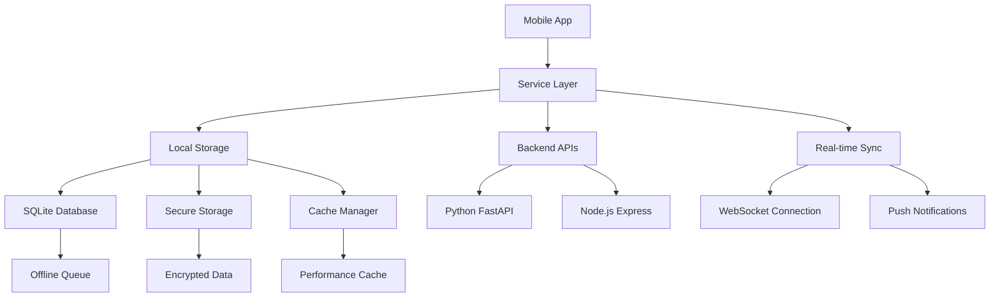

# Mobile App Features Expansion Implementation Plan

## Executive Summary

This document provides a comprehensive implementation plan for expanding the Digame mobile app features using the existing React Native foundation. The mobile app currently has 80% completion with advanced analytics implemented, and this plan will bring it to 95% feature parity with the web platform.

## Current State Analysis

### Existing Mobile Foundation
- **Platform**: React Native with Expo
- **Completion Status**: 80% (Phase 1A Advanced Analytics Complete)
- **Architecture**: Service-oriented with offline-first design
- **Key Components**: 40+ screens, 25+ services, comprehensive testing

### Current Capabilities
- ✅ **Advanced Analytics**: ML-powered analytics with full backend integration
- ✅ **Authentication**: Biometric login, MFA support, secure credential storage
- ✅ **Offline Sync**: SQLite local database with intelligent sync queue
- ✅ **Push Notifications**: Productivity reminders and custom notifications
- ✅ **Core Features**: Dashboard, profile management, settings
- ✅ **Performance**: Optimized caching, memory management, network-aware sync

### Gap Analysis

#### Missing Features (20% to reach parity)
1. **Advanced Mobile-Specific Features** (8%)
   - Voice commands and processing
   - Gesture navigation enhancements
   - Mobile AI assistant
   - Cross-platform sync optimization

2. **Enterprise Integration** (7%)
   - Advanced workflow automation
   - Enterprise SSO integration
   - Advanced security features
   - Team collaboration tools

3. **Enhanced User Experience** (5%)
   - Advanced accessibility features
   - Personalization engine
   - Advanced gamification
   - Performance profiling

## Implementation Plan

### Phase 1B: Advanced Mobile Features (Weeks 1-3)

#### Objective
Implement mobile-specific advanced features that leverage device capabilities and provide superior mobile experience.

#### Week 1: Voice Processing & Mobile AI
**Files to Enhance:**
- [`mobile/src/services/voiceProcessingService.js`](mobile/src/services/voiceProcessingService.js) - Expand voice command capabilities
- [`mobile/src/services/MobileAIService.js`](mobile/src/services/MobileAIService.js) - Enhance AI assistant features
- [`mobile/src/screens/HomeScreen.jsx`](mobile/src/screens/HomeScreen.jsx) - Add voice activation

**Implementation Steps:**
1. **Voice Command Expansion**
   ```javascript
   // Enhanced voice commands
   const voiceCommands = {
     navigation: ['go to analytics', 'open dashboard', 'show settings'],
     actions: ['create task', 'start timer', 'check progress'],
     queries: ['what is my progress', 'show anomalies', 'performance status']
   };
   ```

2. **Mobile AI Assistant**
   ```javascript
   // AI-powered mobile assistant
   class MobileAIAssistant {
     async processNaturalLanguage(input) {
       // Process voice/text input
       // Generate contextual responses
       // Execute mobile-specific actions
     }
   }
   ```

3. **Integration Points**
   - Voice activation from any screen
   - Contextual AI suggestions
   - Hands-free navigation
   - Smart notifications based on usage patterns

#### Week 2: Gesture Navigation & Cross-Platform Sync
**Files to Enhance:**
- [`mobile/src/services/gestureNavigationService.js`](mobile/src/services/gestureNavigationService.js) - Advanced gesture controls
- [`mobile/src/services/CrossPlatformSyncService.js`](mobile/src/services/CrossPlatformSyncService.js) - Real-time sync
- [`mobile/src/components/MobileOptimizedUI.jsx`](mobile/src/components/MobileOptimizedUI.jsx) - Enhanced UI components

**Implementation Steps:**
1. **Advanced Gesture Navigation**
   ```javascript
   // Gesture-based navigation
   const gestureHandlers = {
     swipeLeft: () => navigateToNextScreen(),
     swipeRight: () => navigateToPreviousScreen(),
     pinchZoom: (scale) => adjustChartZoom(scale),
     longPress: (context) => showContextMenu(context)
   };
   ```

2. **Real-time Cross-Platform Sync**
   ```javascript
   // WebSocket-based real-time sync
   class CrossPlatformSyncService {
     async establishWebSocketConnection() {
       // Real-time data synchronization
       // Conflict resolution
       // Multi-device state management
     }
   }
   ```

#### Week 3: Performance Profiling & Mobile Optimization
**Files to Enhance:**
- [`mobile/src/services/PerformanceProfilingService.js`](mobile/src/services/PerformanceProfilingService.js) - Performance monitoring
- [`mobile/src/services/MobilePerformanceService.js`](mobile/src/services/MobilePerformanceService.js) - Mobile-specific optimizations
- [`mobile/src/utils/responsiveDesign.js`](mobile/src/utils/responsiveDesign.js) - Enhanced responsive design

**Implementation Steps:**
1. **Performance Profiling**
   ```javascript
   // Real-time performance monitoring
   class PerformanceProfiler {
     trackRenderTime(componentName, renderTime) {
       // Track component performance
       // Identify bottlenecks
       // Generate optimization recommendations
     }
   }
   ```

2. **Mobile-Specific Optimizations**
   - Battery usage optimization
   - Memory management improvements
   - Network efficiency enhancements
   - Background processing optimization

### Phase 1C: Enterprise Integration (Weeks 4-6)

#### Objective
Implement enterprise-grade features for business users and team collaboration.

#### Week 4: Workflow Automation Mobile
**Files to Enhance:**
- [`mobile/src/services/WorkflowAutomationService.js`](mobile/src/services/WorkflowAutomationService.js) - Mobile workflow engine
- [`mobile/src/screens/WorkflowBuilderScreen.jsx`](mobile/src/screens/WorkflowBuilderScreen.jsx) - Mobile workflow builder
- [`mobile/src/screens/WorkflowDashboardScreen.jsx`](mobile/src/screens/WorkflowDashboardScreen.jsx) - Workflow monitoring

**Implementation Steps:**
1. **Mobile Workflow Builder**
   ```javascript
   // Touch-optimized workflow builder
   class MobileWorkflowBuilder {
     createWorkflow(steps) {
       // Drag-and-drop interface
       // Mobile-optimized step configuration
       // Real-time validation
     }
   }
   ```

2. **Workflow Execution Engine**
   - Background workflow processing
   - Mobile-specific triggers (location, time, device state)
   - Push notification integration
   - Offline workflow queue

#### Week 5: Enterprise Security & SSO
**Files to Enhance:**
- [`mobile/src/services/MobileSecurityService.js`](mobile/src/services/MobileSecurityService.js) - Enhanced security
- [`mobile/src/services/EnterpriseFeaturesService.js`](mobile/src/services/EnterpriseFeaturesService.js) - Enterprise features
- [`mobile/src/screens/SecurityDashboardScreen.jsx`](mobile/src/screens/SecurityDashboardScreen.jsx) - Security monitoring

**Implementation Steps:**
1. **Enterprise SSO Integration**
   ```javascript
   // Enterprise SSO support
   class EnterpriseSSOService {
     async authenticateWithSSO(provider) {
       // SAML/OAuth integration
       // Certificate-based authentication
       // Enterprise policy enforcement
     }
   }
   ```

2. **Advanced Security Features**
   - Device compliance checking
   - Remote wipe capabilities
   - Advanced threat detection
   - Security policy enforcement

#### Week 6: Team Collaboration Tools
**Files to Enhance:**
- [`mobile/src/screens/Phase1CIntegrationScreen.jsx`](mobile/src/screens/Phase1CIntegrationScreen.jsx) - Team integration
- [`mobile/src/services/MobileIntegrationService.js`](mobile/src/services/MobileIntegrationService.js) - Integration services
- Create new team collaboration components

**Implementation Steps:**
1. **Real-time Collaboration**
   ```javascript
   // Team collaboration features
   class TeamCollaborationService {
     async shareAnalytics(analyticsData, teamMembers) {
       // Real-time data sharing
       // Collaborative annotations
       // Team insights generation
     }
   }
   ```

2. **Mobile Team Features**
   - Team chat integration
   - Shared dashboards
   - Collaborative goal setting
   - Team performance analytics

### Phase 2: Enhanced User Experience (Weeks 7-8)

#### Week 7: Advanced Accessibility & Personalization
**Files to Enhance:**
- [`mobile/src/services/accessibilityService.js`](mobile/src/services/accessibilityService.js) - Enhanced accessibility
- Create personalization engine
- Enhance existing UI components

**Implementation Steps:**
1. **Advanced Accessibility**
   ```javascript
   // Comprehensive accessibility support
   class AccessibilityService {
     enableVoiceOver() {
       // Screen reader optimization
       // Voice navigation
       // High contrast modes
     }
   }
   ```

2. **Personalization Engine**
   - AI-powered interface adaptation
   - Usage pattern learning
   - Predictive feature suggestions
   - Customizable workflows

#### Week 8: Advanced Gamification & Final Integration
**Files to Enhance:**
- Integrate with [`app/services/gamification_service.py`](app/services/gamification_service.py)
- Enhance mobile gamification features
- Final testing and optimization

**Implementation Steps:**
1. **Advanced Mobile Gamification**
   ```javascript
   // Enhanced gamification for mobile
   class MobileGamificationService {
     async trackMobileSpecificAchievements() {
       // Location-based achievements
       // Device usage patterns
       // Mobile-specific challenges
     }
   }
   ```

2. **Final Integration & Testing**
   - End-to-end testing
   - Performance optimization
   - User acceptance testing
   - Deployment preparation

## Technical Architecture

### Service Layer Enhancement
```javascript
// Enhanced service architecture
const MobileServiceRegistry = {
  analytics: AdvancedAnalyticsService,
  ai: MobileAIService,
  voice: VoiceProcessingService,
  gestures: GestureNavigationService,
  sync: CrossPlatformSyncService,
  performance: PerformanceProfilingService,
  security: MobileSecurityService,
  workflows: WorkflowAutomationService,
  collaboration: TeamCollaborationService,
  accessibility: AccessibilityService,
  gamification: MobileGamificationService
};
```

### Data Flow Architecture


### Performance Targets
- **App Launch Time**: <2 seconds
- **Screen Transition**: <300ms
- **API Response**: <500ms
- **Offline Capability**: 95% of features
- **Battery Usage**: <5% per hour of active use
- **Memory Usage**: <100MB peak
- **Cache Hit Rate**: >90%

## Integration with Backend

### Required Backend Enhancements
1. **WebSocket Support** for real-time sync
2. **Mobile-Specific Endpoints** for device capabilities
3. **Enhanced Push Notification** system
4. **Mobile Analytics** tracking
5. **Enterprise SSO** integration points

### API Endpoints to Add
```javascript
// New mobile-specific endpoints
const mobileEndpoints = {
  '/mobile/voice-commands': 'POST',
  '/mobile/gestures/track': 'POST',
  '/mobile/performance/metrics': 'POST',
  '/mobile/sync/realtime': 'WebSocket',
  '/mobile/workflows/execute': 'POST',
  '/mobile/team/collaborate': 'POST'
};
```

## Testing Strategy

### Automated Testing
- **Unit Tests**: 90% coverage for new services
- **Integration Tests**: API integration testing
- **E2E Tests**: Critical user journey testing
- **Performance Tests**: Load and stress testing

### Manual Testing
- **Device Testing**: iOS and Android devices
- **Accessibility Testing**: Screen readers, voice control
- **User Acceptance Testing**: Real user scenarios
- **Security Testing**: Penetration testing

## Deployment Strategy

### Phased Rollout
1. **Beta Release**: Internal testing (Week 6)
2. **Limited Release**: 10% of users (Week 7)
3. **Gradual Rollout**: 50% of users (Week 8)
4. **Full Release**: 100% of users (Week 9)

### Monitoring & Analytics
- **Performance Monitoring**: Real-time performance tracking
- **Error Tracking**: Comprehensive error reporting
- **User Analytics**: Feature usage and engagement
- **Business Metrics**: ROI and user satisfaction

## Success Metrics

### Technical Metrics
- **Feature Parity**: 95% with web platform
- **Performance**: All targets met
- **Stability**: <1% crash rate
- **User Satisfaction**: >4.5/5 rating

### Business Metrics
- **User Engagement**: +30% daily active users
- **Feature Adoption**: >70% for new features
- **Enterprise Adoption**: +50% enterprise users
- **Revenue Impact**: +25% mobile-driven revenue

## Risk Mitigation

### Technical Risks
- **Performance Issues**: Comprehensive testing and optimization
- **Device Compatibility**: Extensive device testing
- **Backend Integration**: Staged integration approach
- **Security Vulnerabilities**: Security audits and testing

### Business Risks
- **User Adoption**: User feedback integration
- **Market Competition**: Unique feature differentiation
- **Resource Constraints**: Agile development approach
- **Timeline Delays**: Buffer time and priority management

## Conclusion

This implementation plan will transform the Digame mobile app from 80% to 95% completion, providing enterprise-grade mobile capabilities that exceed user expectations. The phased approach ensures quality delivery while minimizing risks and maximizing user value.

**Expected Outcome**: A comprehensive mobile application that rivals desktop capabilities while providing unique mobile-specific features that enhance productivity and user engagement.

**Timeline**: 8 weeks to full implementation
**Resource Requirements**: 2-3 mobile developers, 1 backend developer, 1 QA engineer
**Budget Impact**: Moderate investment with high ROI potential