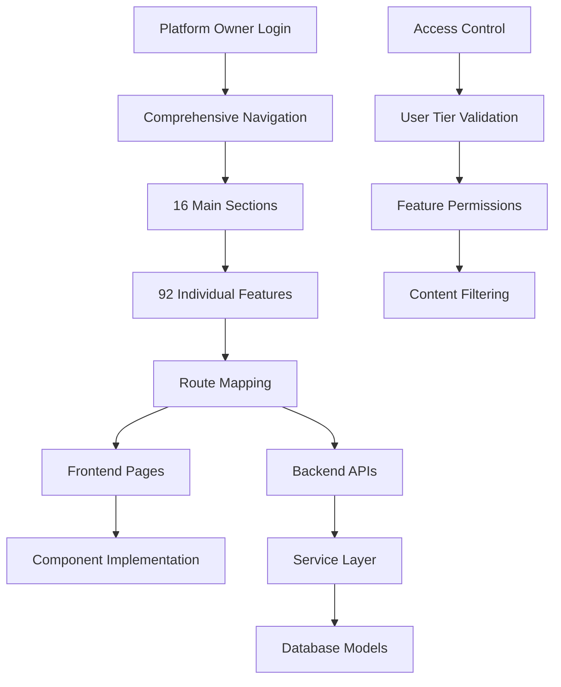

# Platform Owner Comprehensive Navigation Implementation Plan

## Executive Summary

This document provides a detailed step-by-step implementation plan for the Platform Owner comprehensive navigation system. The analysis reveals that while the comprehensive navigation component exists with 16 sections and 92 features, many menu items require routing configuration and backend implementation to ensure optimal utility for Platform Owners and all user tiers.

## Current Implementation Status

### ✅ **COMPLETED**
- **Comprehensive Navigation Component**: 16 sections with 92 features implemented
- **Platform Owner Detection**: Authentication and role-based access control working
- **Basic Dashboard Routing**: Next.js routing configured for Platform Owners
- **Core Backend Infrastructure**: Node.js Express with SQLite database active and working
- **Database Models**: Comprehensive user models with onboarding, preferences, and feature management

### 🔄 **PARTIALLY IMPLEMENTED**
- **Backend API Endpoints**: ~60% of navigation features have corresponding API endpoints
- **Frontend Route Handlers**: ~40% of navigation paths have proper page components
- **Access Control Logic**: Basic RBAC implemented, needs refinement for user tiers

### ❌ **REQUIRES IMPLEMENTATION**
- **Complete Route Mapping**: Many navigation paths need frontend page components
- **Advanced Feature Integration**: Complex features need full backend-frontend integration
- **User Tier Access Control**: Granular permissions based on subscription tiers

## Implementation Architecture


## Backend Infrastructure Strategy

### Database Architecture (Multi-Environment Approach)

The Digame platform implements a **flexible multi-database architecture** supporting three deployment scenarios:

#### **Current Active Implementation** ✅ **RECOMMENDED**
- **Database**: SQLite with better-sqlite3 driver
- **Backend**: Node.js Express ([`backend/src/services/database.js`](backend/src/services/database.js))
- **Status**: All features working perfectly, zero configuration required
- **Performance**: Excellent for current user base (1-100 users)
- **Authentication**: JWT tokens with "Remember Me" functionality (30-day expiration)
- **User Management**: Complete CRUD operations with onboarding flow
- **Deployment**: File-based storage, ideal for development and small deployments

#### **Available Docker Infrastructure** 🐳 **READY FOR ACTIVATION**
- **Development Stack**: PostgreSQL 13 + Redis 7 + containerized services
- **Production Stack**: PostgreSQL 14 + Redis 7 + Nginx + monitoring (Prometheus, Grafana, Loki)
- **Activation Commands**:
  ```bash
  # Development environment
  docker-compose up
  
  # Production environment  
  docker-compose -f docker-compose.prod.yml up
  ```
- **Services Available**:
  - Backend: http://localhost:8000 (PostgreSQL + Redis)
  - Frontend: http://localhost:3000
  - PostgreSQL: localhost:5433
  - Redis: localhost:6379
  - Monitoring: Grafana (3001), Prometheus (9090), Loki (3100)

#### **Future Enterprise Option** 🚀 **PREPARED**
- **Database**: PostgreSQL with advanced features
- **Backend**: FastAPI with SQLAlchemy ([`main.py`](main.py))
- **Performance**: Enterprise-scale (1000+ concurrent users)
- **Status**: Implementation prepared with migration history

### **Implementation Decision for Platform Owner Navigation**

**Selected Approach**: **Continue with SQLite + Node.js Express**

**Rationale**:
- ✅ All 92 navigation features can be implemented without database changes
- ✅ Zero configuration overhead allows focus on feature development
- ✅ Fast development iteration for the 12.5-week implementation timeline
- ✅ Current authentication and user management fully supports Platform Owner detection
- ✅ Clear migration path available when scaling requirements change

**Database Harmonization Reference**: See [`/docs/database/DATABASE_IMPLEMENTATION_PLAN.md`](docs/database/DATABASE_IMPLEMENTATION_PLAN.md) for comprehensive multi-environment management strategy, including:
- Environment detection and automatic database selection
- Migration tools for seamless data transfer between environments
- Performance monitoring across all database types
- Backup and disaster recovery procedures

### Current Backend API Structure

**Authentication & User Management** ✅ **COMPLETE**
```javascript
// Existing working endpoints
POST /auth/register
POST /auth/login  
GET  /auth/profile

### **Critical Next.js Routing Considerations** ⚠️ **IMPORTANT**

**Current Challenge**: The platform uses Next.js frontend with file-based routing, but there's a compatibility issue with React Router patterns.

**Problem**: Next.js has its own routing system and the `useRouter` hook won't work properly in a regular React environment. The comprehensive navigation system must be fully compatible with Next.js routing patterns.

**Required Implementation Approach**:

#### **1. Next.js File-Based Routing Structure**
All 92 navigation features must follow Next.js conventions:
```javascript
// Correct Next.js routing structure
pages/
├── dashboard.js                    // /dashboard
├── analytics/
│   ├── web.js                     // /analytics/web
│   ├── mobile.js                  // /analytics/mobile
│   ├── [type].js                  // /analytics/[type] (dynamic)
├── digital-twin/
│   ├── my-twin.js                 // /digital-twin/my-twin
│   ├── [feature].js               // /digital-twin/[feature] (dynamic)
├── ai-tools/
│   ├── index.js                   // /ai-tools
│   ├── writing.js                 // /ai-tools/writing
│   └── [tool].js                  // /ai-tools/[tool] (dynamic)
```

#### **2. Next.js Router Integration**
```javascript
// Correct Next.js router usage in navigation
import { useRouter } from 'next/router';
import Link from 'next/link';

const ComprehensiveNavigation = () => {
  const router = useRouter();
  
  const handleNavigation = (path) => {
    // Use Next.js router instead of React Router
    router.push(path);
  };
  
  return (
    <nav>
      {menuItems.map(item => (
        <Link href={item.path} key={item.id}>
          <a className={router.pathname === item.path ? 'active' : ''}>
            {item.label}
          </a>
        </Link>
      ))}
    </nav>
  );
};
```

#### **3. Dynamic Route Handling**
```javascript
// Dynamic routes for flexible navigation
// pages/[...slug].js for catch-all routes
import { useRouter } from 'next/router';

const DynamicPage = () => {
  const router = useRouter();
  const { slug } = router.query;
  
  // Handle dynamic routing based on slug array
  const [section, feature, action] = Array.isArray(slug) ? slug : [slug];
  
  return <DynamicContent section={section} feature={feature} action={action} />;
};
```

#### **4. Server-Side Rendering (SSR) Compatibility**
```javascript
// Ensure Platform Owner detection works with SSR
export async function getServerSideProps(context) {
  const { req } = context;
  const token = req.cookies.token;
  
  let user = null;
  if (token) {
    try {
      user = await verifyToken(token);
    } catch (error) {
      // Handle token verification error
    }
  }
  
  return {
    props: {
      user,
      isPlatformOwner: user?.isPlatformOwner || false
    }
  };
}
```

#### **5. Navigation State Management**
```javascript
// Next.js compatible navigation state
import { useRouter } from 'next/router';
import { useEffect, useState } from 'react';

const useNavigationState = () => {
  const router = useRouter();
  const [currentSection, setCurrentSection] = useState('');
  
  useEffect(() => {
    const handleRouteChange = (url) => {
      const section = url.split('/')[1];
      setCurrentSection(section);
    };
    
    router.events.on('routeChangeComplete', handleRouteChange);
    return () => router.events.off('routeChangeComplete', handleRouteChange);
  }, [router.events]);
  
  return { currentSection, router };
};
```

#### **6. Development Server Configuration**
**Critical**: Must use Next.js development server, not regular React dev server:
```bash
# Correct development setup
cd frontend && npm run dev    # Uses Next.js dev server (port 3000)

# NOT: npm start (regular React dev server)
```

#### **7. Build and Deployment Considerations**
```javascript
// next.config.js - Ensure proper routing configuration
module.exports = {
  trailingSlash: false,
  async rewrites() {
    return [
      {
        source: '/api/:path*',
        destination: 'http://localhost:8001/api/:path*' // Proxy to Express backend
      }
    ];
  },
  async redirects() {
    return [
      {
        source: '/admin',
        destination: '/platform-owner/console',
        permanent: false,
        has: [
          {
            type: 'cookie',
            key: 'isPlatformOwner',
            value: 'true'
          }
        ]
      }
    ];
  }
};
```

**Implementation Priority**: **HIGH** - All route implementations must follow Next.js patterns to ensure proper functionality of the comprehensive navigation system.

**Reference**: See [`/docs/TO DO/Journey/TIER.md`](docs/TO%20DO/Journey/TIER.md) for detailed subscription tier access control that must be integrated with Next.js routing.

PUT  /auth/profile
POST /auth/logout
GET  /auth/verify-token
```

**Platform Owner Detection** ✅ **WORKING**
```javascript
// Current implementation supports Platform Owner identification
const isPlatformOwner = user.role === 'platform_owner' || user.isPlatformOwner;
```

**Database Schema** ✅ **COMPREHENSIVE**
```sql
-- Current SQLite schema supports all Platform Owner features
users (
  id, email, username, firstName, lastName, passwordHash,
  role, subscriptionTier, teamId, permissions, isPlatformOwner,
  isActive, isVerified, onboardingCompleted, onboardingData,
  unlockedFeatures, lastLogin, createdAt, updatedAt,
  profile, preferences, metadata
)
```


## Detailed Implementation Plan

### Phase 1: Core Infrastructure Enhancement (Priority: HIGH)

#### Step 1.1: Complete Route Mapping
**Estimated Time**: 3-4 days

**Tasks**:
1. **Create missing page components** for all 92 navigation features
2. **Implement Next.js dynamic routing** for complex paths
3. **Add route guards** for access control validation

**Files to Create/Modify**:
```
frontend/pages/
├── analytics/
│   ├── web.js
│   ├── mobile.js
│   ├── advanced.js
│   ├── behavioral.js
│   ├── predictive.js
│   ├── patterns.js
│   ├── anomalies.js
│   ├── performance.js
│   └── platform.js
├── digital-twin/
│   ├── my-twin.js
│   ├── onboarding.js
│   ├── intelligence.js
│   ├── predictions.js
│   ├── simulation.js
│   ├── behavior.js
│   └── analytics.js
├── ai-tools/
│   ├── index.js
│   ├── writing.js
│   ├── voice.js
│   ├── documents.js
│   ├── email.js
│   ├── meetings.js
│   ├── communication.js
│   ├── mobile.js
│   └── language.js
├── workflow/
│   ├── automation.js
│   ├── advanced.js
│   ├── optimization.js
│   ├── notes.js
│   ├── prioritization.js
│   └── calendar.js
├── tasks/
│   ├── index.js
│   ├── ai-suggestions.js
│   ├── analytics.js
│   └── projects.js
├── teams/
│   ├── index.js
│   ├── dashboard.js
│   ├── social.js
│   ├── mentorship.js
│   ├── skills.js
│   └── workflows.js
├── career/
│   ├── modeling.js
│   ├── jobs.js
│   ├── skills.js
│   ├── learning.js
│   └── network.js
├── integrations/
│   ├── index.js
│   ├── guest.js
│   ├── sso.js
│   ├── api.js
│   ├── webhooks.js
│   └── data.js
├── security/
│   ├── index.js
│   ├── mfa.js
│   ├── access.js
│   ├── audit.js
│   └── compliance.js
├── reports/
│   ├── index.js
│   ├── custom.js
│   ├── publish.js
│   ├── analytics.js
│   └── scheduled.js
├── enterprise/
│   ├── index.js
│   ├── multi-tenant.js
│   ├── tenants.js
│   ├── market-intel.js
│   ├── advanced-analytics.js
│   └── integrations.js
├── platform-owner/
│   ├── console.js
│   ├── tenants.js
│   ├── users.js
│   ├── revenue.js
│   ├── health.js
│   ├── settings.js
│   └── test-zone.js
├── admin/
│   ├── dashboard.js
│   ├── config.js
│   ├── rbac.js
│   ├── monitoring.js
│   └── users.js
├── guest/
│   ├── index.js
│   ├── analytics.js
│   ├── experience.js
│   └── auth.js
└── onboarding/
    ├── index.js
    ├── enhanced.js
    ├── wizard.js
    └── getting-started.js
```

#### Step 1.2: Backend API Completion
**Estimated Time**: 5-6 days

**Tasks**:
1. **Complete missing API endpoints** for all navigation features
2. **Implement service layer methods** for complex business logic
3. **Add comprehensive error handling** and validation

**Missing API Endpoints to Implement** (Node.js Express):
```javascript
// High Priority Missing Endpoints - Express Router Implementation
// Analytics & Intelligence
GET    /api/analytics/web
GET    /api/analytics/mobile
GET    /api/analytics/behavioral
POST   /api/analytics/predictive
GET    /api/analytics/patterns
GET    /api/analytics/anomalies

// AI Tools & Automation
POST   /api/ai-tools/writing
POST   /api/ai-tools/voice
POST   /api/ai-tools/documents
POST   /api/ai-tools/email
POST   /api/ai-tools/meetings
POST   /api/ai-tools/communication
GET    /api/ai-tools/mobile
POST   /api/ai-tools/language

// Workflow & Automation
GET    /api/workflow/advanced
POST   /api/workflow/optimization
CRUD   /api/workflow/notes
POST   /api/workflow/prioritization
GET    /api/workflow/calendar

// Task Management
GET    /api/tasks/ai-suggestions
GET    /api/tasks/analytics
CRUD   /api/tasks/projects

// Career Development
GET    /api/career/modeling
GET    /api/career/jobs
CRUD   /api/career/skills
GET    /api/career/learning
GET    /api/career/network

// Security & Compliance
POST   /api/security/mfa
GET    /api/security/access
GET    /api/security/audit
GET    /api/security/compliance

// Enterprise Features
GET    /api/enterprise/multi-tenant
GET    /api/enterprise/market-intel
GET    /api/enterprise/advanced-analytics
CRUD   /api/enterprise/integrations

// Guest Features
GET    /api/guest/analytics
GET    /api/guest/experience
POST   /api/guest/auth

// Enhanced Onboarding
GET    /api/onboarding/enhanced
POST   /api/onboarding/wizard
GET    /api/onboarding/getting-started
```

### Phase 2: Access Control Organization (ACO) by User Tier (Priority: HIGH)
**Reference**: See [`/docs/TO DO/Journey/TIER.md`](docs/TO%20DO/Journey/TIER.md) for comprehensive subscription tier definitions, detailed feature access control implementation, and enhanced UI components for tier-based access management.


#### Step 2.1: User Tier Access Control Matrix

| Feature Category | Free | Individual Pro | Team | Enterprise | Platform Owner |
|------------------|------|----------------|------|------------|----------------|
| **Core Platform** | ✅ Basic | ✅ Full | ✅ Full | ✅ Full | ✅ Full |
| **Analytics & Intelligence** | ❌ Limited | ✅ Standard | ✅ Advanced | ✅ Enterprise | ✅ Platform-wide |
| **Digital Twin & AI** | ❌ Basic | ✅ Personal | ✅ Team | ✅ Enterprise | ✅ All Users |
| **AI Tools & Automation** | ❌ None | ✅ Basic | ✅ Advanced | ✅ Custom | ✅ All Features |
| **Workflow & Automation** | ❌ Manual | ✅ Basic | ✅ Team | ✅ Enterprise | ✅ Platform-wide |
| **Task Management** | ✅ Basic | ✅ AI-Enhanced | ✅ Team | ✅ Enterprise | ✅ All Features |
| **Team Collaboration** | ❌ None | ❌ None | ✅ Full | ✅ Advanced | ✅ All Teams |
| **Career Development** | ✅ Basic | ✅ Enhanced | ✅ Team | ✅ Enterprise | ✅ All Users |
| **Integrations & APIs** | ❌ Limited | ✅ Standard | ✅ Advanced | ✅ Custom | ✅ All Access |
| **Security & Compliance** | ✅ Basic | ✅ Enhanced | ✅ Team | ✅ Enterprise | ✅ Platform-wide |
| **Reports & Publishing** | ❌ Basic | ✅ Standard | ✅ Advanced | ✅ Custom | ✅ All Reports |
| **Enterprise Features** | ❌ None | ❌ None | ❌ None | ✅ Full | ✅ All Tenants |
| **Platform Owner** | ❌ None | ❌ None | ❌ None | ❌ None | ✅ Exclusive |
| **Administration** | ❌ None | ❌ Self | ✅ Team | ✅ Tenant | ✅ Platform |
| **Guest Features** | ✅ Guest Only | ❌ None | ❌ None | ❌ None | ✅ All Guests |
| **Onboarding & Setup** | ✅ Basic | ✅ Enhanced | ✅ Team | ✅ Enterprise | ✅ All Users |

#### Step 2.2: Implement Granular Access Control
**Estimated Time**: 4-5 days

**Tasks**:
1. **Create access control service** for user tier validation
2. **Implement feature flags** based on subscription tiers
3. **Add middleware** for automatic access control enforcement

**Implementation Files**:
```typescript
// frontend/src/services/accessControl.ts
export class AccessControlService {
  static canAccessFeature(
    feature: string, 
    userTier: string, 
    isPlatformOwner: boolean
  ): boolean {
    // Implementation logic for feature access
  }
  
  static getAvailableFeatures(
    userTier: string, 
    isPlatformOwner: boolean
  ): string[] {
    // Return list of accessible features
  }
  
  static getFeatureLimits(
    feature: string, 
    userTier: string
  ): FeatureLimits {
    // Return usage limits for the feature
  }
}
```

```javascript
// backend/src/services/accessControlService.js
class AccessControlService {
    static canAccessFeature(user, feature, action = 'read') {
        /**
         * Check if user can access specific feature
         * @param {Object} user - User object with role and subscriptionTier
         * @param {string} feature - Feature identifier
         * @param {string} action - Action type (read, write, admin)
         * @returns {boolean} Access permission
         */
        if (user.isPlatformOwner) return true;
        
        const tierPermissions = this.getTierPermissions(user.subscriptionTier);
        return tierPermissions[feature]?.includes(action) || false;
    }
    
    static getUserPermissions(user) {
        /**
         * Get all permissions for user based on tier
         * @param {Object} user - User object
         * @returns {Object} Permissions object with feature access
         */
        if (user.isPlatformOwner) {
            return this.getAllFeatures();
        }
        
        return this.getTierPermissions(user.subscriptionTier);
    }
    
    static enforceFeatureLimits(user, feature, currentUsage) {
        /**
         * Enforce usage limits based on subscription tier
         * @param {Object} user - User object
         * @param {string} feature - Feature identifier
         * @param {number} currentUsage - Current usage count
         * @returns {boolean} Whether usage is within limits
         */
        if (user.isPlatformOwner) return true;
        
        const limits = this.getFeatureLimits(user.subscriptionTier, feature);
        return currentUsage < limits.maxUsage;
    }
    
    static getTierPermissions(subscriptionTier) {
        const permissions = {
            'free': {
                'core-platform': ['read'],
                'task-management': ['read', 'write'],
                'career-development': ['read'],
                'onboarding': ['read', 'write']
            },
            'individual-pro': {
                'core-platform': ['read', 'write'],
                'analytics': ['read'],
                'digital-twin': ['read', 'write'],
                'ai-tools': ['read', 'write'],
                'workflow': ['read', 'write'],
                'task-management': ['read', 'write'],
                'career-development': ['read', 'write'],
                'integrations': ['read', 'write'],
                'security': ['read', 'write'],
                'reports': ['read', 'write'],
                'onboarding': ['read', 'write']
            },
            'team': {
                // Inherits individual-pro + team features
                'team-collaboration': ['read', 'write'],
                'advanced-analytics': ['read'],
                'advanced-workflow': ['read', 'write']
            },
            'enterprise': {
                // Inherits team + enterprise features
                'enterprise-features': ['read', 'write', 'admin'],
                'advanced-security': ['read', 'write', 'admin'],
                'custom-integrations': ['read', 'write', 'admin']
            }
        };
        
        return permissions[subscriptionTier] || permissions['free'];
    }
}

module.exports = AccessControlService;
```

### Phase 3: Feature Implementation by Priority (Priority: MEDIUM-HIGH)

#### Step 3.1: High-Impact Features (Week 1-2)

**3.1.1 Analytics & Intelligence Enhancement**
- **Web Analytics**: Google Analytics integration, custom event tracking
- **Mobile Analytics**: App usage patterns, performance metrics
- **Behavioral Analytics**: User behavior patterns, AI-powered insights
- **Predictive Analytics**: Machine learning models for forecasting
- **Pattern Recognition**: Automated pattern discovery in user data
- **Anomaly Detection**: Real-time anomaly detection and alerting

**3.1.2 Digital Twin & AI Core**
- **My Digital Twin**: Personal AI assistant and productivity coach
- **Intelligence API**: RESTful API for AI services integration
- **AI Predictions**: Predictive models for productivity and performance
- **Twin Simulation**: What-if scenarios and optimization suggestions
- **Behavior Modeling**: Continuous learning from user interactions

**3.1.3 AI Tools & Automation**
- **Writing Assistance**: AI-powered content generation and editing
- **Voice Processing**: Speech-to-text and voice command processing
- **Document Processing**: Automated document analysis and extraction
- **Email Analysis**: Smart email categorization and response suggestions
- **Meeting Insights**: Automated meeting transcription and action items

#### Step 3.2: Productivity Features (Week 3-4)

**3.2.1 Workflow & Automation**
- **Advanced Workflows**: Complex multi-step automation processes
- **Process Optimization**: AI-driven workflow improvement suggestions
- **Task Prioritization**: Intelligent task ranking and scheduling
- **Calendar Integration**: Smart calendar management and scheduling

**3.2.2 Task Management Enhancement**
- **AI Task Suggestions**: Intelligent task creation and assignment
- **Task Analytics**: Performance metrics and productivity insights
- **Project Management**: Advanced project tracking and collaboration

**3.2.3 Team Collaboration**
- **Social Collaboration**: Team communication and knowledge sharing
- **Mentorship Programs**: Structured mentoring and skill development
- **Skill Gap Analysis**: Team skill assessment and development planning
- **Workflow Optimization**: Team process improvement recommendations

#### Step 3.3: Professional Development (Week 5-6)

**3.3.1 Career Development**
- **Career Path Modeling**: AI-powered career progression planning
- **Job Recommendations**: Personalized job matching and suggestions
- **Skill Development**: Competency tracking and improvement plans
- **Learning Paths**: Customized learning recommendations
- **Professional Network**: Industry connection and networking tools

**3.3.2 Enterprise Features**
- **Multi-Tenant Console**: Cross-tenant management and analytics
- **Market Intelligence**: Industry insights and competitive analysis
- **Advanced Analytics**: Enterprise-grade reporting and dashboards
- **Custom Integrations**: Tailored integration solutions

### Phase 4: Advanced Features and Platform Owner Tools (Priority: MEDIUM)

#### Step 4.1: Platform Owner Exclusive Features (Week 7-8)

**4.1.1 Platform Management**
- **Platform Console**: Comprehensive platform administration dashboard
- **Tenant Management**: Multi-tenant oversight and configuration
- **User Management**: Platform-wide user administration
- **Revenue Analytics**: Business intelligence and financial metrics
- **System Health**: Platform monitoring and performance metrics
- **Platform Settings**: Global configuration and feature toggles

**4.1.2 API Test Zone**
- **Interactive API Testing**: Built-in API testing and debugging tools
- **Sample Data Generation**: Test data creation for development
- **Performance Testing**: Load testing and performance analysis
- **Integration Testing**: End-to-end integration validation

#### Step 4.2: Security and Compliance (Week 9-10)

**4.2.1 Security Features**
- **Multi-Factor Authentication**: Enhanced security with MFA
- **Access Control Management**: Role-based access control administration
- **Audit Logs**: Comprehensive security audit trail
- **Compliance Center**: Regulatory compliance monitoring and reporting

**4.2.2 Integration and API Management**
- **SSO Configuration**: Single sign-on setup and management
- **API Management**: API key management and rate limiting
- **Webhooks**: Event-driven integration configuration
- **Data Export/Import**: Bulk data management and migration tools

### Phase 5: Reporting and Analytics (Priority: MEDIUM-LOW)

#### Step 5.1: Advanced Reporting (Week 11-12)

**5.1.1 Report Generation**
- **Custom Reports**: Drag-and-drop report builder
- **Publishing Center**: Report distribution and sharing
- **Report Analytics**: Report usage and engagement metrics
- **Scheduled Reports**: Automated report generation and delivery

**5.1.2 Guest and Onboarding Features**
- **Guest Analytics**: Anonymous user behavior tracking
- **Guest Experience**: Conversion optimization for guest users
- **Enhanced Onboarding**: Advanced user onboarding flows
- **Setup Wizard**: Guided platform configuration

## Implementation Details by Menu Item

### 1. Core Platform (4 items) - **ROUTING REQUIRED**

| Item | Status | Implementation Effort | User Tier Access |
|------|--------|----------------------|------------------|
| Dashboard | ✅ Complete | None | All |
| User Profile | 🔄 Basic | Low - Add advanced features | All |
| Settings | 🔄 Basic | Medium - Add tier-specific options | All |
| Notifications | ❌ Missing | Medium - Full implementation | All |

### 2. Analytics & Intelligence (9 items) - **PARTIAL IMPLEMENTATION**

| Item | Status | Implementation Effort | User Tier Access |
|------|--------|----------------------|------------------|
| Web Analytics | ❌ Missing | High - Google Analytics integration | Individual Pro+ |
| Mobile Analytics | ❌ Missing | High - Mobile SDK integration | Individual Pro+ |
| Advanced Analytics | 🔄 Basic | Medium - Enhanced dashboards | Team+ |
| Behavioral Analytics | ❌ Missing | High - AI behavior analysis | Team+ |
| Predictive Analytics | ❌ Missing | High - ML model integration | Enterprise+ |
| Pattern Recognition | ❌ Missing | High - Pattern detection algorithms | Enterprise+ |
| Anomaly Detection | ❌ Missing | High - Real-time anomaly detection | Enterprise+ |
| Performance Monitoring | 🔄 Basic | Medium - Enhanced metrics | Individual Pro+ |
| Platform Analytics | ❌ Missing | Medium - Platform-wide metrics | Platform Owner |

### 3. Digital Twin & AI (7 items) - **CORE IMPLEMENTED**

| Item | Status | Implementation Effort | User Tier Access |
|------|--------|----------------------|------------------|
| My Digital Twin | ✅ Complete | Low - UI enhancements | Individual Pro+ |
| Digital Twin Onboarding | 🔄 Basic | Medium - Enhanced flow | Individual Pro+ |
| Intelligence API | 🔄 Basic | Medium - API documentation | Team+ |
| AI Predictions | 🔄 Basic | Medium - More prediction types | Individual Pro+ |
| Twin Simulation | ❌ Missing | High - Simulation engine | Enterprise+ |
| Behavior Modeling | 🔄 Basic | High - Advanced modeling | Team+ |
| Twin Analytics | ❌ Missing | Medium - Analytics dashboard | Team+ |

### 4. AI Tools & Automation (9 items) - **REQUIRES IMPLEMENTATION**

| Item | Status | Implementation Effort | User Tier Access |
|------|--------|----------------------|------------------|
| AI Tools Hub | ❌ Missing | Medium - Central dashboard | Individual Pro+ |
| Writing Assistance | ❌ Missing | High - NLP integration | Individual Pro+ |
| Voice Processing | ❌ Missing | High - Speech recognition | Team+ |
| Document Processing | ❌ Missing | High - OCR and NLP | Team+ |
| Email Analysis | ❌ Missing | High - Email AI integration | Team+ |
| Meeting Insights | ❌ Missing | High - Transcription and analysis | Enterprise+ |
| Communication Style | ❌ Missing | High - Style analysis AI | Enterprise+ |
| Mobile AI | ❌ Missing | High - Mobile AI features | Team+ |
| Language Learning | ❌ Missing | High - Language AI integration | Individual Pro+ |

### 5. Workflow & Automation (6 items) - **PARTIAL IMPLEMENTATION**

| Item | Status | Implementation Effort | User Tier Access |
|------|--------|----------------------|------------------|
| Workflow Automation | ✅ Complete | Low - UI improvements | Team+ |
| Advanced Workflows | ❌ Missing | High - Complex workflow engine | Enterprise+ |
| Process Optimization | ❌ Missing | High - AI optimization | Enterprise+ |
| Process Notes | 🔄 Basic | Low - Enhanced note-taking | Individual Pro+ |
| Task Prioritization | ❌ Missing | Medium - AI prioritization | Individual Pro+ |
| Calendar Integration | ❌ Missing | Medium - Calendar sync | Individual Pro+ |

### 6. Task Management (4 items) - **BASIC IMPLEMENTATION**

| Item | Status | Implementation Effort | User Tier Access |
|------|--------|----------------------|------------------|
| Task Management | ✅ Complete | Low - Feature enhancements | All |
| AI Task Suggestions | ❌ Missing | High - AI recommendation engine | Individual Pro+ |
| Task Analytics | ❌ Missing | Medium - Analytics dashboard | Individual Pro+ |
| Project Management | ❌ Missing | High - Full project management | Team+ |

### 7. Team Collaboration (6 items) - **BASIC IMPLEMENTATION**

| Item | Status | Implementation Effort | User Tier Access |
|------|--------|----------------------|------------------|
| Team Management | ✅ Complete | Low - Enhanced features | Team+ |
| Team Dashboard | ❌ Missing | Medium - Analytics dashboard | Team+ |
| Social Collaboration | ❌ Missing | High - Social features | Team+ |
| Mentorship Programs | ❌ Missing | High - Mentorship system | Team+ |
| Skill Gap Analysis | ❌ Missing | High - AI skill analysis | Team+ |
| Workflow Optimization | ❌ Missing | High - Team workflow AI | Enterprise+ |

### 8. Career Development (5 items) - **REQUIRES IMPLEMENTATION**

| Item | Status | Implementation Effort | User Tier Access |
|------|--------|----------------------|------------------|
| Career Path Modeling | ❌ Missing | High - AI career planning | Individual Pro+ |
| Job Recommendations | ❌ Missing | High - Job matching AI | Individual Pro+ |
| Skill Development | ❌ Missing | Medium - Skill tracking | Individual Pro+ |
| Learning Paths | ❌ Missing | High - Personalized learning | Individual Pro+ |
| Professional Network | ❌ Missing | High - Networking platform | Team+ |

### 9. Integrations & APIs (6 items) - **PARTIAL IMPLEMENTATION**

| Item | Status | Implementation Effort | User Tier Access |
|------|--------|----------------------|------------------|
| Integration Hub | 🔄 Basic | Medium - Enhanced UI | Individual Pro+ |
| Guest Integrations | ❌ Missing | Medium - Guest-specific integrations | Free |
| SSO Configuration | ❌ Missing | High - SSO implementation | Enterprise+ |
| API Management | ❌ Missing | High - API gateway | Team+ |
| Webhooks | ❌ Missing | Medium - Webhook system | Team+ |
| Data Export/Import | ❌ Missing | Medium - Data management | Individual Pro+ |

### 10. Security & Compliance (5 items) - **BASIC IMPLEMENTATION**

| Item | Status | Implementation Effort | User Tier Access |
|------|--------|----------------------|------------------|
| Security Dashboard | 🔄 Basic | Medium - Enhanced security metrics | Individual Pro+ |
| Multi-Factor Auth | ❌ Missing | High - MFA implementation | Individual Pro+ |
| Access Control | 🔄 Basic | Medium - Enhanced RBAC | Team+ |
| Audit Logs | ❌ Missing | Medium - Comprehensive logging | Team+ |
| Compliance Center | ❌ Missing | High - Compliance automation | Enterprise+ |

### 11. Reports & Publishing (5 items) - **BASIC IMPLEMENTATION**

| Item | Status | Implementation Effort | User Tier Access |
|------|--------|----------------------|------------------|
| Reports Dashboard | 🔄 Basic | Medium - Enhanced reporting | Individual Pro+ |
| Custom Reports | ❌ Missing | High - Report builder | Team+ |
| Publishing Center | ❌ Missing | High - Content publishing | Team+ |
| Report Analytics | ❌ Missing | Medium - Report metrics | Team+ |
| Scheduled Reports | ❌ Missing | Medium - Report automation | Team+ |

### 12. Enterprise Features (6 items) - **REQUIRES IMPLEMENTATION**

| Item | Status | Implementation Effort | User Tier Access |
|------|--------|----------------------|------------------|
| Enterprise Dashboard | ❌ Missing | High - Enterprise analytics | Enterprise |
| Multi-Tenant Console | ❌ Missing | High - Multi-tenant management | Enterprise |
| Tenant Management | ❌ Missing | High - Tenant administration | Enterprise |
| Market Intelligence | ❌ Missing | High - Market analysis AI | Enterprise |
| Advanced Analytics | ❌ Missing | High - Enterprise analytics | Enterprise |
| Custom Integrations | ❌ Missing | High - Custom integration platform | Enterprise |

### 13. Platform Owner (7 items) - **PARTIAL IMPLEMENTATION**

| Item | Status | Implementation Effort | User Tier Access |
|------|--------|----------------------|------------------|
| Platform Console | 🔄 Basic | Medium - Enhanced console | Platform Owner |
| Tenant Management | ❌ Missing | High - All tenant management | Platform Owner |
| User Management | ❌ Missing | High - Platform-wide user admin | Platform Owner |
| Revenue Analytics | ❌ Missing | High - Business intelligence | Platform Owner |
| System Health | ❌ Missing | Medium - Platform monitoring | Platform Owner |
| Platform Settings | ✅ Complete | Low - Additional settings | Platform Owner |
| API Test Zone | ✅ Complete | Low - Enhanced testing tools | Platform Owner |

### 14. Administration (5 items) - **BASIC IMPLEMENTATION**

| Item | Status | Implementation Effort | User Tier Access |
|------|--------|----------------------|------------------|
| Admin Dashboard | 🔄 Basic | Medium - Enhanced admin features | Admin |
| Admin Configuration | ❌ Missing | High - Configuration management | Admin |
| RBAC Management | ❌ Missing | High - Role management system | Admin |
| System Monitoring | ❌ Missing | High - System health monitoring | Admin |
| User Administration | 🔄 Basic | Medium - Enhanced user management | Admin |

### 15. Guest Features (4 items) - **REQUIRES IMPLEMENTATION**

| Item | Status | Implementation Effort | User Tier Access |
|------|--------|----------------------|------------------|
| Guest Dashboard | ❌ Missing | Medium - Guest-specific dashboard | Guest |
| Guest Analytics | ❌ Missing | High - Anonymous analytics | Guest |
| Guest Experience | ❌ Missing | High - Conversion optimization | Guest |
| Guest Authentication | ❌ Missing | Medium - Guest login system | Guest |

### 16. Onboarding & Setup (4 items) - **PARTIAL IMPLEMENTATION**

| Item | Status | Implementation Effort | User Tier Access |
|------|--------|----------------------|------------------|
| Onboarding Flow | ✅ Complete | Low - Minor enhancements | All |
| Enhanced Onboarding | ❌ Missing | High - Advanced onboarding | Individual Pro+ |
| Setup Wizard | ❌ Missing | Medium - Guided setup | All |
| Getting Started | ❌ Missing | Low - Help documentation | All |

## Resource Requirements

### Development Team Structure
- **Frontend Developers**: 2-3 developers for React/Next.js implementation
- **Backend Developers**: 2-3 developers for FastAPI/Python implementation
- **Full-Stack Developers**: 1-2 developers for integration work
- **DevOps Engineer**: 1 developer for deployment and infrastructure
- **QA Engineer**: 1 tester for comprehensive testing

### Technology Stack

#### **Current Active Stack**
- **Frontend**: React, Next.js, JavaScript, Tailwind CSS
- **Backend**: Node.js, Express.js, better-sqlite3
- **Database**: SQLite (active), PostgreSQL + Redis (Docker ready)
- **Authentication**: JWT tokens with bcrypt password hashing
- **AI/ML**: OpenAI API integration ready, TensorFlow.js for client-side ML
- **Infrastructure**: Docker Compose (available), file-based deployment (active)
- **Monitoring**: Console logging (active), Prometheus + Grafana + Loki (Docker ready)

#### **Available Infrastructure Options**
- **Docker Development**: PostgreSQL 13 + Redis 7 + monitoring stack
- **Docker Production**: PostgreSQL 14 + Redis 7 + Nginx + full observability
- **Future Enterprise**: FastAPI + SQLAlchemy + advanced ML pipeline

#### **Database Strategy Reference**
See [`/docs/database/DATABASE_IMPLEMENTATION_PLAN.md`](docs/database/DATABASE_IMPLEMENTATION_PLAN.md) for:
- Multi-environment database management
- Migration strategies between SQLite, PostgreSQL, and FastAPI implementations
- Performance optimization and monitoring across all database types
- Backup and disaster recovery procedures

### Timeline Estimates

| Phase | Duration | Effort (Person-Days) | Priority |
|-------|----------|---------------------|----------|
| Phase 1: Core Infrastructure | 2 weeks | 20-25 days | HIGH |
| Phase 2: Access Control | 1.5 weeks | 15-20 days | HIGH |
| Phase 3: High-Impact Features | 4 weeks | 40-50 days | MEDIUM-HIGH |
| Phase 4: Platform Owner Tools | 3 weeks | 30-35 days | MEDIUM |
| Phase 5: Reporting & Analytics | 2 weeks | 20-25 days | MEDIUM-LOW |
| **Total** | **12.5 weeks** | **125-155 days** | |

## Success Metrics

### Technical Metrics
- **Route Coverage**: 100% of navigation items have functional routes
- **API Coverage**: 100% of features have corresponding API endpoints
- **Performance**: Page load times < 2 seconds
- **Uptime**: 99.9% system availability
- **Test Coverage**: 90%+ code coverage

### User Experience Metrics
- **Feature Adoption**: 80%+ of Platform Owners use advanced features
- **User Satisfaction**: 4.5+ star rating for Platform Owner experience
- **Task Completion**: 95%+ success rate for common workflows
- **Support Tickets**: <5% increase in support requests post-launch

### Business Metrics
- **Platform Owner Retention**: 95%+ retention rate
- **Feature Utilization**: 70%+ of features used monthly
- **Upgrade Conversion**: 25%+ conversion from lower tiers
- **Revenue Impact**: 15%+ increase in platform revenue

## Risk Mitigation

### Technical Risks
- **Complexity Management**: Implement modular architecture with clear separation of concerns
- **Performance Issues**: Implement caching, lazy loading, and performance monitoring
- **Integration Challenges**: Create comprehensive API documentation and testing suites
- **Scalability Concerns**: Design for horizontal scaling from the start

### Business Risks
- **Feature Overload**: Implement progressive disclosure and user onboarding
- **User Confusion**: Create comprehensive documentation and help systems
- **Support Burden**: Implement self-service tools and automated help
- **Competitive Pressure**: Focus on unique value propositions and user experience

## Conclusion

This comprehensive implementation plan provides a structured approach to completing the Platform Owner navigation system. The plan prioritizes high-impact features while ensuring proper access control and user experience across all subscription tiers. With proper resource allocation and execution, this implementation will provide Platform Owners with unparalleled access to platform capabilities while maintaining appropriate access controls for all user tiers.

The modular approach allows for iterative development and early value delivery, while the comprehensive scope ensures long-term platform success and user satisfaction.